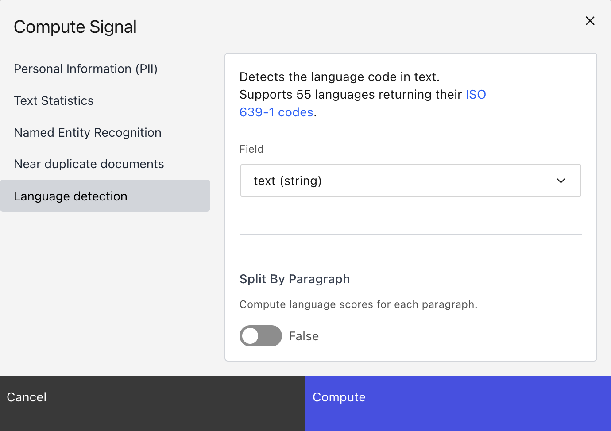
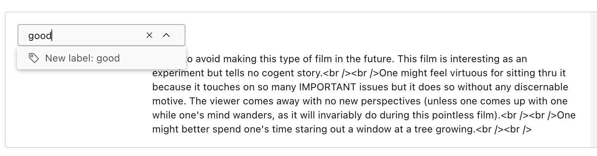
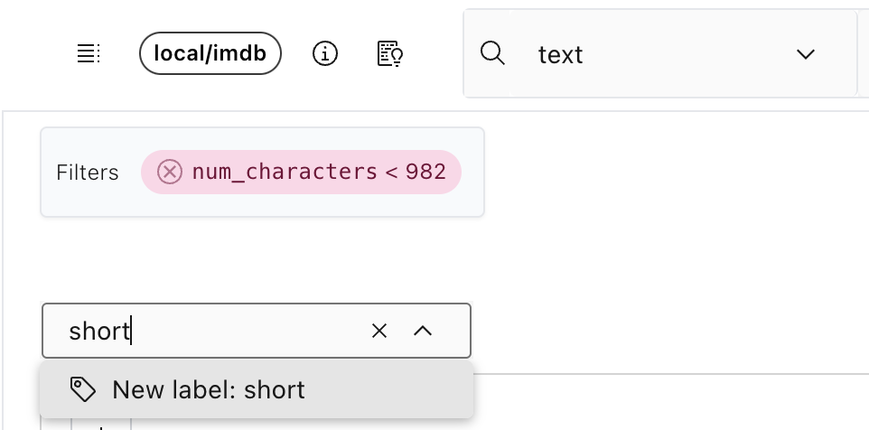

<h1 align="center">🌸 Lilac</h1>
<h3 align="center" style="font-size: 20px; margin-bottom: 4px">Curate better data for LLMs</h3>
<p align="center">
  <a style="padding: 4px;"  href="https://lilacai-lilac.hf.space/">
    <span style="margin-right: 4px; font-size: 12px">🔗</span> <span style="font-size: 14px">Try the Lilac web demo!</span>
  </a>
  <br/><br/>
  <a href="https://lilacml.com/">
        
    </a>
    <a href="https://discord.gg/jNzw9mC8pp">
        
    </a>
    <a href="https://github.com/lilacai/lilac/blob/main/LICENSE">
          
    </a>
    <br/>
    <a href="https://github.com/lilacai/lilac">
      
    </a>
    <a href="https://twitter.com/lilac_ai">
      
    </a>
</p>

Lilac helps you **curate data** for LLMs, from RAGs to fine-tuning datasets.

Lilac runs **on-device** using open-source LLMs with a UI and Python API for:

- **Exploring** datasets with natural language (documents)
- **Annotating & structuring** data (e.g. PII detection, profanity, text statistics)
- **Semantic search** to find similar results to a query
- **Conceptual search** to find and tag results that match a fuzzy concept (e.g. low command of
  English language)
- **Clustering** data semantically for understanding & deduplication
- **Labeling** and **Bulk Labeling** to curate data

### 3 minute walkthrough

[](https://www.youtube.com/watch?v=RrcvVC3VYzQ)

## 🔥 Getting started

### 💻 Install

```sh
pip install lilac[all]
```

If you prefer no local installation, you can fork the
[fork the HuggingFace Spaces demo](https://lilacai-lilac.hf.space/). Documentation
[here](https://lilacml.com/huggingface/huggingface_spaces.html).

### 🌐 Start a webserver

Start a Lilac webserver from the CLI:

```sh
lilac start ~/my_project
```

Or start the Lilac webserver from Python:

```py
import lilac as ll

ll.start_server(project_dir='~/my_project')
```

This will open start a webserver at http://localhost:5432/ where you can now load datasets and
explore them.

### Run via Docker

We publish images for `linux/amd64` and `linux/arm64` on Docker Hub under
[lilacai](https://hub.docker.com/u/lilacai).

The container runs on the virtual port `8000`, this command maps it to the host machine port `5432`.

If you have an existing lilac project, mount it and set the `LILAC_PROJECT_DIR` environment
variable:

```sh
docker run -it \
  -p 5432:8000 \
  --volume /host/path/to/data:/data \
  -e LILAC_PROJECT_DIR="/data" \
  --gpus all \ # Remove if you don't have a GPU, or on MacOS.
  lilacai/lilac
```

To build your own custom image run the following command, otherwise skip to the next step.

```sh
docker build -t lilac .
```

### 📊 Load data

Datasets can be loaded directly from HuggingFace, CSV, JSON,
[LangSmith from LangChain](https://www.langchain.com/langsmith), SQLite,
[LLamaHub](https://llamahub.ai/), Pandas, Parquet, and more. More documentation
[here](https://lilacml.com/datasets/dataset_load.html).

```python
import lilac as ll

ll.set_project_dir('~/my_project')

config = ll.DatasetConfig(
  namespace='local',
  name='imdb',
  source=ll.HuggingFaceSource(dataset_name='imdb'))

dataset = ll.create_dataset(config)
```

If you prefer, you can load datasets directly from the UI without writing any Python:


### 🔎 Explore

> [🔗 Try OpenOrca-100K before installing!](https://lilacai-lilac.hf.space/datasets#lilac/OpenOrca-100k)

Once we've loaded a dataset, we can explore it from the UI and get a sense for what's in the data.
More documentation [here](https://lilacml.com/datasets/dataset_explore.html).


### ⚡ Annotate with Signals (PII, Text Statistics, Language Detection, Neardup, etc)

Annotating data with signals will produce another column in your data.

```python
import lilac as ll

ll.set_project_dir('~/my_project')

dataset = ll.get_dataset('local', 'imdb')

# [Language detection] Detect the language of each document.
dataset.compute_signal(ll.LangDetectionSignal(), 'text')

# [PII] Find emails, phone numbers, ip addresses, and secrets.
dataset.compute_signal(ll.PIISignal(), 'text')

# [Text Statistics] Compute readability scores, number of chars, TTR, non-ascii chars, etc.
dataset.compute_signal(ll.PIISignal(), 'text')

# [Near Duplicates] Computes clusters based on minhash LSH.
dataset.compute_signal(ll.NearDuplicateSignal(), 'text')

# Print the resulting manifest, with the new field added.
print(dataset.manifest())
```

We can also compute signals from the UI:



### 🔎 Search

Semantic and conceptual search requires computing an embedding first:

```python
dataset.compute_embedding('gte-small', path='text')
```

#### Semantic search

In the UI, we can search by semantic similarity or by classic keyword search to find chunks of
documents similar to a query:


We can run the same search in Python:

```python
rows = dataset.select_rows(
  columns=['text', 'label'],
  searches=[
    ll.SemanticSearch(
      path='text',
      embedding='gte-small')
  ],
  limit=1)

print(list(rows))
```

#### Conceptual search

Conceptual search is a much more controllable and powerful version of semantic search, where
"concepts" can be taught to Lilac by providing positive and negative examples of that concept.

Lilac provides a set of built-in concepts, but you can create your own for very specif


We can create a concept in Python with a few examples, and search by it:

```python
concept_db = ll.DiskConceptDB()
db.create(namespace='local', name='spam')
# Add examples of spam and not-spam.
db.edit('local', 'spam', ll.concepts.ConceptUpdate(
  insert=[
    ll.concepts.ExampleIn(label=False, text='This is normal text.'),
    ll.concepts.ExampleIn(label=True, text='asdgasdgkasd;lkgajsdl'),
    ll.concepts.ExampleIn(label=True, text='11757578jfdjja')
  ]
))

# Search by the spam concept.
rows = dataset.select_rows(
  columns=['text', 'label'],
  searches=[
    ll.ConceptSearch(
      path='text',
      concept_namespace='lilac',
      concept_name='spam',
      embedding='gte-small')
  ],
  limit=1)

print(list(rows))
```

### 🏷️ Labeling

Lilac allows you to label individual points, or slices of data:


We can also label all data given a filter. In this case, adding the label "short" to all text with a
small amount of characters. This field was produced by the automatic `text_statistics` signal.



We can do the same in Python:

```python
dataset.add_labels(
  'short',
  filters=[
    (('text', 'text_statistics', 'num_characters'), 'less', 1000)
  ]
)
```

Labels can be exported for downstream tasks. Detailed documentation
[here](https://lilacml.com/datasets/dataset_labels.html).

## 💬 Contact

For bugs and feature requests, please
[file an issue on GitHub](https://github.com/lilacai/lilac/issues).

For general questions, please [visit our Discord](https://discord.com/invite/jNzw9mC8pp).
