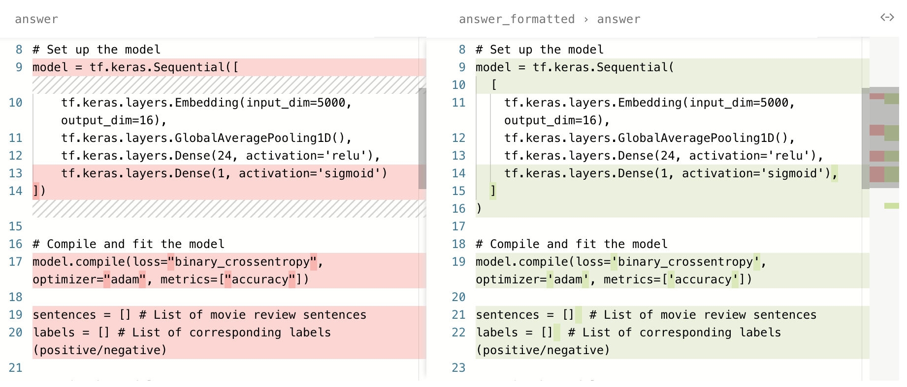
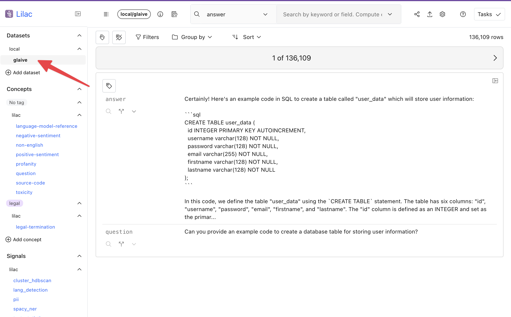
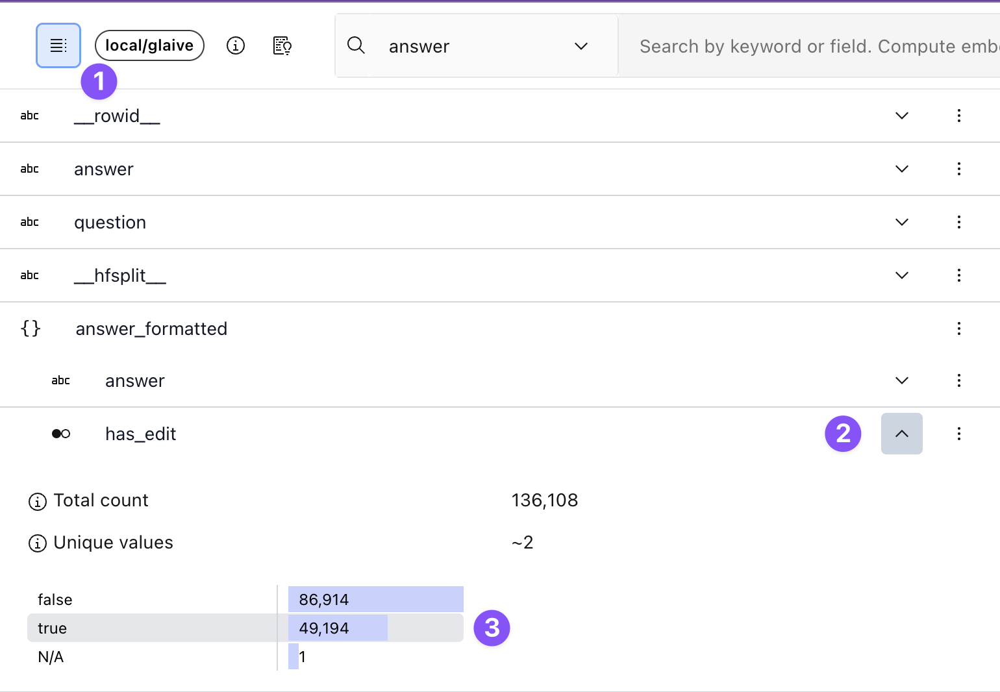
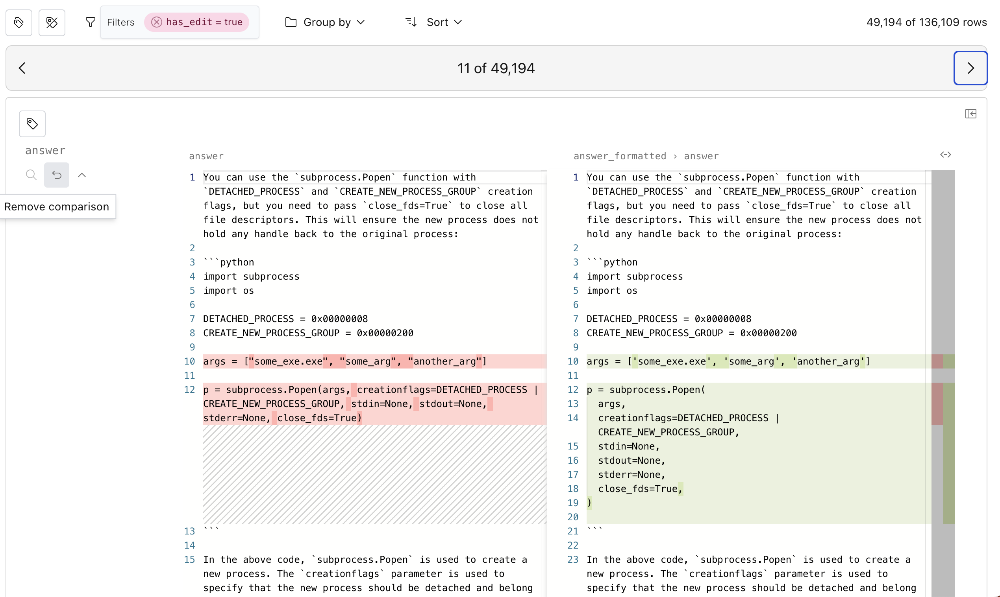
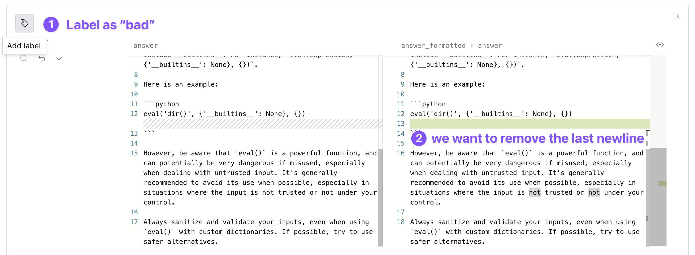

# Curate a coding dataset with Lilac

_Dec 7, 2023_

Good data is the engine that drives progress in AI. Companies that have control of their data can
add unique capabilities and differentiate their product. Companies are also recognizing that
building models with their own data reduces cost, and improves speed, control and compliance.

Data curation is often the most effective way to control how AI models behave. This process involves
standard procedures like de-duplication and PII scrubbing, but also the long-tail of product
specific requirements that can deliver an amazing user experience.

At Lilac, we also believe that having more eyes on data ultimately leads to fundamental discoveries
of how a model will behave, giving the developer more control of their downstream AI product.

In this blog post, we'll delve into the excellent
[Glaive coding assistant](https://huggingface.co/datasets/glaiveai/glaive-code-assistant) dataset
with the goal of fine-tuning a code assistant model. We'll modify the dataset so that code outputted
by our AI product follows consistent formatting rules, and we'll visualize how the dataset has
changed.



If you prefer a video walkthrough, check out the video below:

<iframe width="560" height="315" src="https://www.youtube.com/embed/bw8JUpAOSZQ?si=acoTBsseNg5nku40" title="YouTube video player" frameborder="0" allow="accelerometer; autoplay; clipboard-write; encrypted-media; gyroscope; picture-in-picture; web-share" allowfullscreen></iframe>

## A First Look at the Glaive Dataset

Let's load the Glaive dataset into Lilac from the HuggingFace hub. In this example, we're going to
be using a Jupyter notebook (follow along
[here](https://github.com/lilacai/lilac/blob/main/notebooks/CurateCodingDataset.ipynb)) or
[view the live demo on HuggingFace](https://lilacai-lilac.hf.space/datasets#lilac/glaive&expandedStats=%7B%22answer_formatted.has_edit%22%3Atrue%7D&query=%7B%22filters%22%3A%5B%7B%22path%22%3A%5B%22answer_formatted%22%2C%22has_edit%22%5D%2C%22op%22%3A%22equals%22%2C%22value%22%3A1%7D%5D%7D&compareColumns=%5B%7B%22column%22%3A%5B%22answer%22%5D%2C%22compareToColumn%22%3A%5B%22answer_formatted%22%2C%22answer%22%5D%2C%22swapDirection%22%3Afalse%7D%5D&rowId=%22fffc265c-845e-4a2b-b3ce-2caa61fed0f4%22).

```python
import lilac as ll

config = ll.DatasetConfig(
 namespace='local',
 name='glaive',
 source=ll.HuggingFaceSource(dataset_name='glaiveai/glaive-code-assistant'),
)
dataset = ll.create_dataset(config)
```

Let's start by visually inspecting the dataset so we can get a feel for what it contains. Start the
Lilac web server and choose the glaive dataset from the navigation menu on the left:

```python
ll.start_server()
```

```
INFO:     Uvicorn running on http://127.0.0.1:5432 (Press CTRL+C to quit)
```

</img>

You can see that the dataset consists of `question` and `answer` pairs, where the answer is in
markdown format, often containing python code blocks. Immediately we can see that the python
formatting is not consistent with our desired style, which will result in an AI product producing
inconsistent code.

Let's standardize the model's code output by running the excellent
[ruff](https://docs.astral.sh/ruff/) formatter.

## Formatting Python code blocks with Ruff

In our Jupyter notebook, we'll define a simple function that takes one row from this dataset and
returns a new `answer_formatted` column that has two sub-fields:

1. `answer`: the rewritten output with formatted python code
2. `has_edit`: true when the code formatter made a change. We will use the bit in the UI to filter
   on the rows that got updated.

To modify the dataset in Lilac, we will use [](#Dataset.map). To learn more about `Dataset.map`, see
the guide on [](../datasets/dataset_edit.md).

````python
import re
import subprocess
import lilac as ll

code_block_re = re.compile('```(py|python)\n(.*)?\n```', re.MULTILINE | re.DOTALL)

# Format the code blocks of the "answer" column using the `ruff` formatter.
def format_code(item):
 text = item['answer']
 if not text:
   return None

 new_text = text
 has_edit = False
 for _, code_block in code_block_re.findall(text):
   if not code_block:
     continue
   try:
     # Call the ruff binary to format the current code block.
     formatted_code_block = subprocess.check_output(
       ['ruff', 'format', '-'], input=code_block, encoding='utf-8', stderr=subprocess.DEVNULL
     )
     new_text = new_text.replace(code_block, formatted_code_block)
     has_edit = True
   except subprocess.CalledProcessError:
     continue
 return {'answer': new_text, 'has_edit': has_edit}

ds = ll.get_dataset('local', 'glaive-coder')
ds.map(format_code, output_column='answer_formatted', num_jobs=-1, execution_type='processes')
````

## Dataset.map

`Dataset.map` is the main vehicle for making edits to data. It's similar to HuggingFace's
[`Dataset.map()`](https://huggingface.co/docs/datasets/process#map) with a few key differences:

- The output of Lilac's `Dataset.map` is always stored in a separate column. This enables tracking
  of lineage information for derived columns, as well as avoiding copying the entire dataset by
  storing only the new column output.
- If the map fails mid-way (e.g. with an exception, or your computer dies), you can resume
  computation without losing any intermediate results. This is important when the map function is
  expensive or slow (e.g. calling GPT to edit data, or calling an expensive on-device embedding
  model).
- The map should return an item for each input item, or `None`.
- While the computation is running, the Lilac UI will show a progress bar. When it completes, the UI
  will auto-refresh and we can use the new column.

Now that we've edited the “answer”, let's visualize the changes to get a better sense of the
behavior of our formatter and understand any side-effects.

## Comparing `answer` to `answer_formatted`

First, let's focus on the rows that have been changed by applying a filter on our newly added
`formatted_answer > has_edit` column. To do this, open the schema on the left hand side, find the
`answer_formatted > has_edit` column, expand the histogram, and click the `True`` bar, applying a
filter for the edited results.



Next, let's compare the two fields and show a visual diff. To do this, we click the “compare to”
button next to `answer` and select the `answer_formatted > answer` field. We can easily flip through
different examples by using the left and right arrow keys.



The process of refining data is iterative. If the diff is not exactly what we like, we can change
the parameters to the formatter, re-run the map with `overwrite=True`, and see the new results.

If some of the edits are not ideal, we can click on the label in the top left corner of the example
and tag it as "bad". Then we can apply a filter for "bad" examples and make sure that new versions
of our map improved on those examples. Conversely, we can tag "good" examples and see if we regress
as we iterate on the dataset.



Once we are comfortable with how the formatter changes python code, we can export the edited dataset
using the download dialog or the python API. See
[the guide for exporting data](../datasets/dataset_export.md) for more details.

## Going forward

We believe that text is becoming new programming language. It is the source code of LLMs.

At Lilac, we are building the tooling to work with this new programming language, bringing the
tooling, rigor, and best practices from software engineering to the development of the data behind
AI systems.

There is much more to come!

If you have any questions or feedback, please reach out to us on
[Discord](https://discord.gg/jNzw9mC8pp) or [Github](https://github.com/lilacai/lilac).
