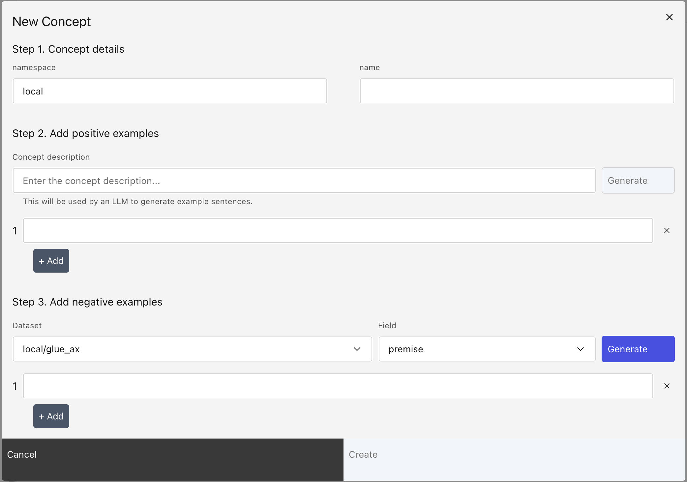

# Create a concept

Creating your own concept can be done from the UI with just a few clicks, or in Python with just a
few lines of code.

A concept is created by seeding it with a few positive and negative examples, and then will be tuned
given a data source.

## Create from UI

To create a concept from the UI, click the "Add concept" button in the navigation on the left. This
will open a modal:

</img>

### Step 1: Name your concept

- `namespace`: The namespace to put the concept. By default, we use `local` to specify a local
  namespace. If you want to organize concepts, you may put concepts of different types in their own
  namespace.
- `name`: The name of your concept. This should be unique in the chosen namespace.

### Step 2: Add positive examples

Add a short concept description. The concept description can be used to seed the concept, using an
LLM, with fake positive examples. Often times it's hard to find positive examples, or invent fake
positive examples, so this step can be useful to seed the concept.

However, it's not required. You can choose to seed the concept with as many positive examples as you
want.

### Step 3: Add negative examples

Just like in step 2, we can use an LLM to generate fake negative examples, or you can enter your own
negative examples. Negative examples can either be:

1. The opposite of the concept.
2. Unrelated to the concept (e.g. for `positive-sentiment`, the text can be neutral: neither
   positive or negative)

```{important}
Negative examples are important to seed the concept! Without negative examples, Lilac cannot
infer what is related to the concept, and what is not.
```

### Step 4: Create

Clicking the `Create` button will create the concept.

```{important}
The concept has been seeded, but needs to be tuned on real data. See
[Concept Tuning](concept_tuning.md) for details on how to tune a Concept to your data.
```

## Create from Python

Creating a concept can be done in a few lines of code from Python.

First, we need an instance of the [](#DiskConceptDB) which will allow us to create and write a
concept to disk.

```python
import lilac as ll

db = ll.DiskConceptDB()
```

Creating a concept can be done with "db.create":

```python
db.create(namespace='test', name='test_concept')
```

Once the concept is created, we can add example data points to the concept:

```python
examples = [
  ll.concepts.ExampleIn(label=False, text='The quick brown fox jumps over the lazy dog.'),
  ll.concepts.ExampleIn(label=True, text='This product is amazing!'),
  ll.concepts.ExampleIn(label=True, text='Thank you for your awesome work on this UI.')
]
db.edit('local', 'positive-product-reviews', ll.concepts.ConceptUpdate(insert=examples))
```

From here, we can continue to add examples, or we can use the concept. See
[Using concepts](concept_use.md) for details on how to use a concept.

```python
signal = ll.signals.ConceptSignal(
  namespace='local',
  concept_name='positive-product-reviews',
  embedding='gte-small')

result = list(signal.compute(['This product is amazing, thank you!']))

print(result)
```

Output:

```
[[{'__value__': {'start': 0, 'end': 35}, 'score': 0.8421050169191884}]]
```
