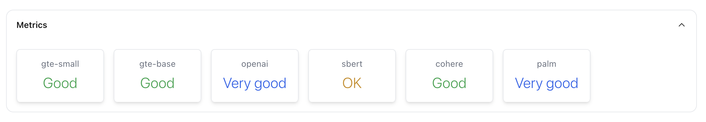

# Concept metrics

```{tip}
[Try Lilac concepts on HuggingFace](https://huggingface.co/spaces/lilacai/lilac)
```

We can quantify the quality of a concept using an [F1 score](https://en.wikipedia.org/wiki/F-score)
from the labeled examples.

Moreover, the choice of an _embedding_ will affect the quality of the concept in practice. Some
embeddings can capture nuanced concepts much better than other embeddings, especially when the model
is much larger. See [Embeddings](../embeddings/embeddings.md) for details on embeddings.

The quality of a concept with an embedding is determined by computing the
[F1 score](https://en.wikipedia.org/wiki/F-score) using at most 15
[cross-validation](https://scikit-learn.org/stable/modules/cross_validation.html) splits. A single
example is left out of the training set, a model is trained, and we measure the correctness of
predicting the left-out example.

The human readable scores are based on this score:

- `Great`: 0.95 to 1.0
- `Very good`: 0.9 to 0.95
- `Good`: 0.8 to 0.9
- `OK`: 0.5 to 0.9
- `Not good`: 0.0 to 0.5

## From the UI

From the concepts preview page, there is a metrics panel, which determines the quality for each
embedding for that concept:

</img>

Toxicity is a particularly difficult concept, as it requires a deeper understanding of the meaning
of the text, so larger embeddings typically do better for this concept.

## From Python

Let's compute the metrics for our concept, with the `gte-small` embedding.

```python
model_db = ll.DiskConceptModelDB(ll.DiskConceptDB())

model = model_db.get(
  'local', 'positive-product-reviews',
  embedding_name='gte-small')

print(model.get_metrics())
```

Output:

```
f1=0.9183673469387754 precision=0.9 recall=1.0 roc_auc=0.9595959595959596 overall=<OverallScore.VERY_GOOD: 'very_good'>
```
