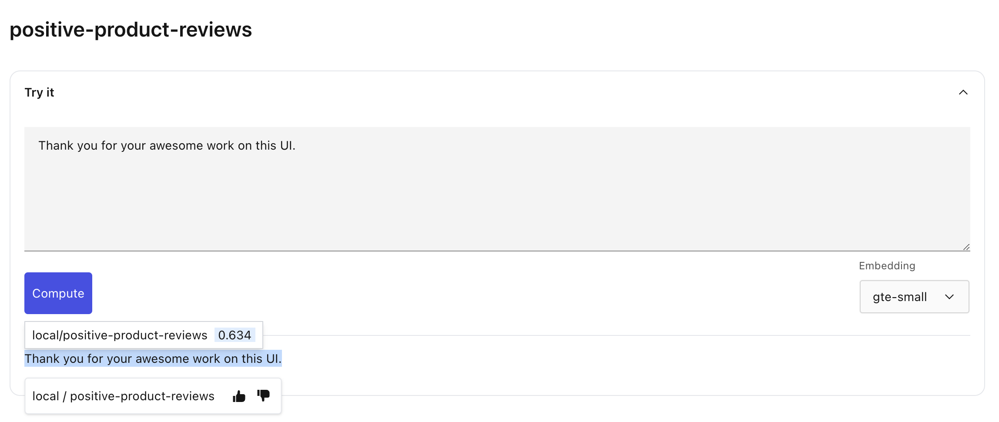
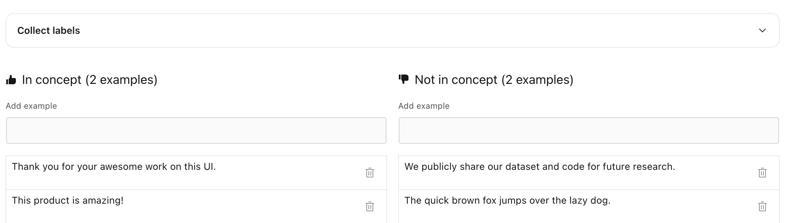
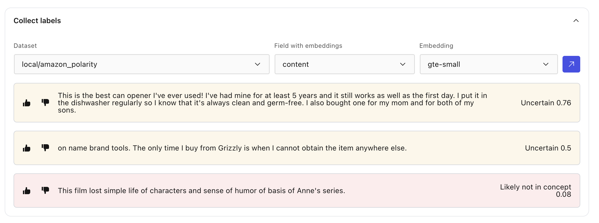

# Tuning a concept

```{tip}
[Try Lilac concepts on HuggingFace](https://huggingface.co/spaces/lilacai/lilac)
```

Often times, after creating a concept or using an off-the-shelf-concept, the concept needs to be
tuned to fit shape of your data (often called the "distribution" of your data).

Tuning a concept is as simple as giving a "thumbs up" or "thumbs down" to new pieces of text that
are relevant, or unrelated, to the concept.

## Tune from UI

Whenever a chunk of text is scored by a concept, it can be clicked to reveal a details panel that
allows you to thumbs up or thumbs down a section of text. This can be done from the concept preview
page, or from the dataset page.

</img>

In this example, the score is relatively low for this piece of text that is clearly related to
positive product reviews.

Clicking the thumbs up will add it to the set of positive examples for the concept, which can be
seen at the bottom of the concept preview page:

</img>

Examples can always be removed by clicking the trash icon.

Thinking of hypothetical examples can be hard, so Lilac provides a labeler mechanism that will under
"Collect Labels" that will feed examples that Lilac thinks are:

- In the concept
- Confused (close to the decision threshold of 0.5)
- Not in the concept.

</img>

You can use this labeler to quickly tune your concept.

> **_NOTE:_** It is important to give enough positive and _negative_ examples to the concept for it
> to work well. See the [Concept Metrics](concept_metrics.md) for details on measuring performance
> of a concept.

## Tune from Python

Tuning from Python looks very similar to [Creating a concept](concept_create.md#create-from-python).

You can list examples in a concept by using the [](DiskConceptDB.get) method.

```python
concept = db.get('local', 'positive-product-reviews')

print(concept.data)
```

Output:

```
{
  'd86e4cb53c70443b8d8782a6847f4752': Example(label=False, text='The quick brown fox jumps over the lazy dog.', img=None, origin=None, draft='main', id='d86e4cb53c70443b8d8782a6847f4752'),
  '7d12d83bb06747698381d6326fc7fd27': Example(label=True, text='This product is amazing!', img=None, origin=None, draft='main', id='7d12d83bb06747698381d6326fc7fd27'),
  'c4cf7a874d91466aade2e705dea6cc79': Example(label=True, text='Thank you for your awesome work on this UI.', img=None, origin=None, draft='main', id='c4cf7a874d91466aade2e705dea6cc79'),
  '5cfab7b6ac5d4ef49cb2561f7fd90ba5': Example(label=False, text='We publicly share our dataset and code for future research.', img=None, origin=None, draft='main', id='5cfab7b6ac5d4ef49cb2561f7fd90ba5')
}
```

You can continue to add examples:

```python
train_data = [
  ll.ExampleIn(label=False, text='The weather is beautiful today'),
]
db.edit(
  'local', 'positive-product-reviews',
  ll.ConceptUpdate(insert=train_data))
```

You can remove examples by using the unique ID given above:

```python
db.edit(
  'local', 'positive-product-reviews',
  ll.ConceptUpdate(remove=['d86e4cb53c70443b8d8782a6847f4752']))
```

You can entirely delete a concept using the [](DiskConceptDB.remove) method:

```python
db.remove('local', 'positive-product-reviews')
```
