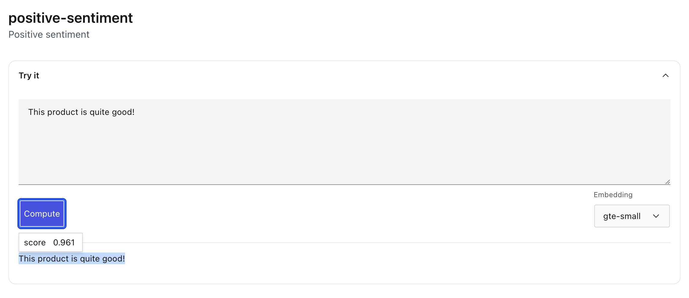

# Use a concept

Applying a concept to text can be done in one of two ways:

1. For a single document
2. For a dataset of documents. See [Applying concepts to a Dataset](../datasets/dataset_concepts.md)
   for how to apply a concept to a dataset.

A concept is simply a collection of positive and negative examples. To use a concept, we also need
to choose an _Embedding_. Some embeddings, like `gte` and `sbert` will run entirely on device. Other
embeddings like `openai`, `cohere`, or `palm` require an API key and will make a request to retrieve
embeddings. See [Concept Technical Details](concept_technical.md) for details on embeddings.

The quality of a concept depends on the chosen embedding. See [Concept Metrics](concept_metrics.md)
for details on understanding the quality of a concept with an embedding.

## From the UI

```{tip}
[Try Lilac concepts on HuggingFace](https://huggingface.co/spaces/lilacai/lilac)
```

To use a concept from the UI, click the concept from the Navigation panel, which will open the
concept preview page.

</img>

From here, you can copy paste text and click "Compute" to compute the concept score for chunks of
the given text. The sections of text where Lilac thinks text is related to your concept will be
highlighted blue.

## From Python

To use a concept from python, we must create a [`ConceptSignal`](#signals.ConceptSignal). In this
example, we'll use the `gte-small` embedding which runs entirely on device.

```py
import lilac as ll

signal = ll.signals.ConceptSignal(
  namespace='lilac',
  concept_name='positive-sentiment',
  embedding='gte-small')

# Signals take an iterable of inputs, and return a list of items that match the shape of the input.
result = list(signal.compute(['This product is amazing, thank you!']))

print(result)
```

Output:

```sh
[[{'__value__': {'start': 0, 'end': 35}, 'score': 0.9302721936202625}]]
```

The resulting output returns a list of spans (start and end positions of the input text) with the
resulting concept score.
