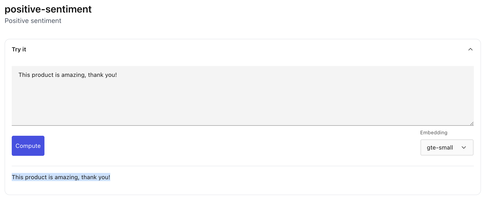
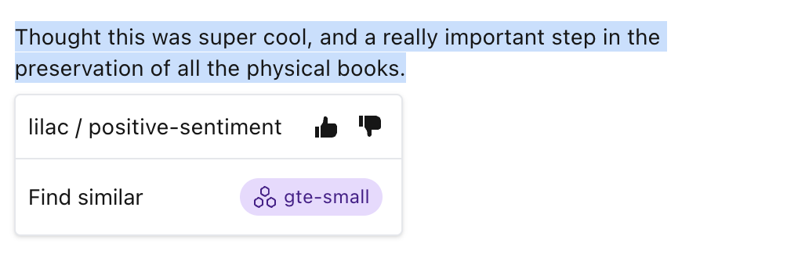

# Concepts

```{tip}
[Try Lilac concepts on HuggingFace](https://huggingface.co/spaces/lilacai/lilac)
```

## What is a concept?

A concept in Lilac is the algorithmic version of a concept we have in our head, applied to natural
language.

Often time human language concepts are fuzzy, hard to codify into a computer, or are simply "you
know it when you see it".

For instance, if we read a product review by a very happy customer, we understand that it is
conceptually _positive sentiment_.

When Lilac learns about a
[_positive sentiment_](https://lilacai-lilac.hf.space/concepts#lilac/positive-sentiment) concept, it
can be used to determine whether sections of a document are positive in sentiment, while
generalizing to other types of positive language that it has never seen.

```{note}
The Lilac [positive sentiment concept](https://lilacai-lilac.hf.space/concepts#lilac/positive-sentiment) below highlights text blue that is positive in sentiment.

</img>
```

In practice, a concept is simply a collection of positive (text that is related to the concept) and
negative examples (text that is unrelated to the concept, either the opposite, or simply unrelated).

## How are they made?

```{tip}
See [Create a concept](concept_create.md) for details on how to create your own concept.
```

Concepts are built by showing our AI examples of sections of text that are related to the concept,
and those that are not. In real time, the Lilac AI will learn from you and then it can be used to
score text or rank and score many documents from a dataset.

In practice, simpler concepts can be created with very few examples (~20), but more subtle concepts,
like [Toxicity](https://lilacai-lilac.hf.space/concepts#lilac/toxicity), you need to teach the
concept with more examples. In general, more examples are usually better, as long as they are not
contradictory.

Tuning a concept can be done slowly over time as your concept is used on new data sources! When you
update a concept, your feedback will be permanently saved. Of course, there will always be mistakes,
so the Lilac tool allows you to [tune](concept_tuning.md) the concept by correcting Lilac concept
predictions whenever you are in the tool, and Lilac will update the concept.

```{note}
When you click a highlighted section of text that is scored by a concept, you can correct it by clicking the thumbs up or down. In real time, the concept will adjust to the new information.

</img>
```

For technical details, see [Technical Details](concept_technical.md).

## Making a decision

Lilac concepts produce a score between 0 and 1 of relevance to the concept. Concepts are calibrated
so that a score greater than 0.5 is "in the concept", otherwise it is "out of the concept".
