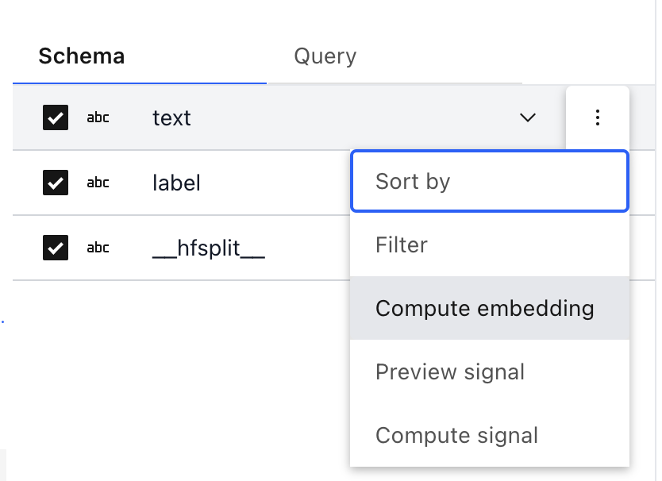
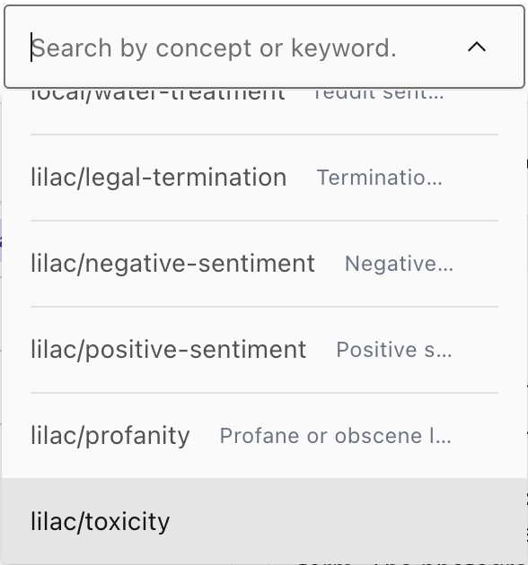
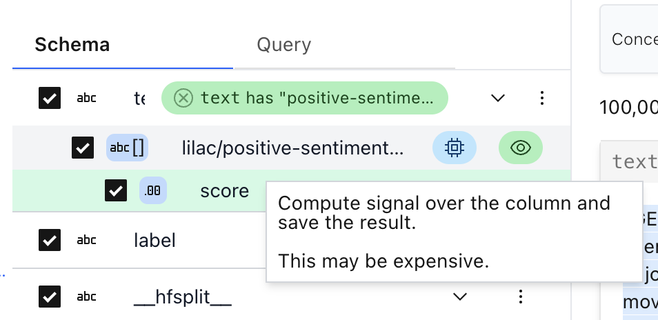
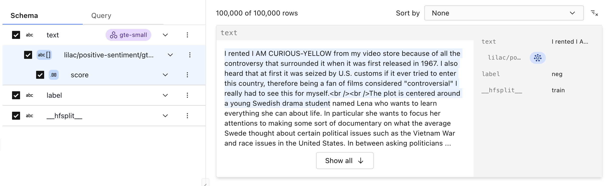

# Apply a concept to a dataset

Concepts can be applied to an entire dataset to _rank_ and _score_ documents according to relevance
to a concept.

## From the UI

#### Step 1: Compute an embedding index

Before we can use conceptual search, we first must compute an embedding index for the field of
interest. See [Embeddings](../embeddings/embeddings.md) for details on choosing an embedding.

```{important}
Embedding indexes can be expensive to compute, however this is a one-time task and enables you to search by any concept once it's computed.
```

We can compute an embedding index with one of two approaches:

##### 1a. From the search box

From the search box, we can choose a column and an embedding. Then we can click the blue gear icon
to compute the index!

</img>

##### 1b. From the schema

From the schema, we can choose the field's hamburger menu to click "Compute Embedding".

</img>

#### Step 2: Search by concept

Once the embedding index has been computed, we can now use the search box to search by a concept:

</img>

Dataset items will be sorted, descending, by the highest concept score for each item. Chunks of text
will be highlighted according to their concept score:

</img>

#### (Optional) Step 3: Compute the concept for the whole column

Search by concept does not produce a score for every item in the dataset. If we want to add a score
for every item, click the blue "compute" chip next to the preview in the schema.

</img>

Once the concept score has been computed, you will see a new column in the schema, highlighted in
blue:

</img>

## From Python

Before we can search by concept, we must first compute an embedding index. Let's compute `gte-small`
over the `text` field:

```python
dataset = ll.get_dataset('local', 'imdb')
dataset.compute_embedding('gte-small', path='text')
```

Once this is complete, we can search by a concept. Let's search by the `lilac/positive-sentiment`
concept.

```python
r = dataset.select_rows(
  ['text', 'label'],
  searches=[
    ll.ConceptSearch(
      concept_namespace='lilac',
      concept_name='positive-sentiment',
      path='text')],
  limit=5)
```

Search by concept does not produce a score for every item in the dataset. If we want to want to add
a score for every item, we can call [](#Dataset.compute_signal):

```python
dataset.compute_concept(
  namespace='lilac',
  concept_name='positive-sentiment',
  embedding='gte-small',
  path='text')
```

Once this is complete, we can print the items with the enriched column:

```python
r = dataset.select_rows(['*'], limit=5)
print(r.df())
```

Output:

```
                                                text label __hfsplit__  \
0  I rented I AM CURIOUS-YELLOW from my video sto...   neg       train
1  "I Am Curious: Yellow" is a risible and preten...   neg       train
2  If only to avoid making this type of film in t...   neg       train
3  This film was probably inspired by Godard's Ma...   neg       train
4  I would put this at the top of my list of film...   neg       train

         text.lilac/positive-sentiment/gte-small/v11
0  [{'score': 0.532249927520752, '__value__': {'s...
1  [{'score': 0.059535492211580276, '__value__': ...
2  [{'score': 0.026503529399633408, '__value__': ...
3  [{'score': 0.17499613761901855, '__value__': {...
4  [{'score': 0.09144255518913269, '__value__': {...
```
