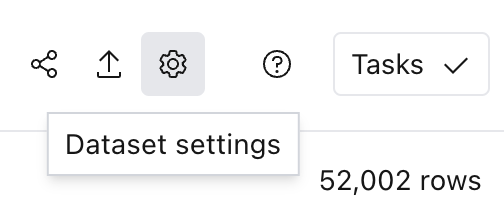
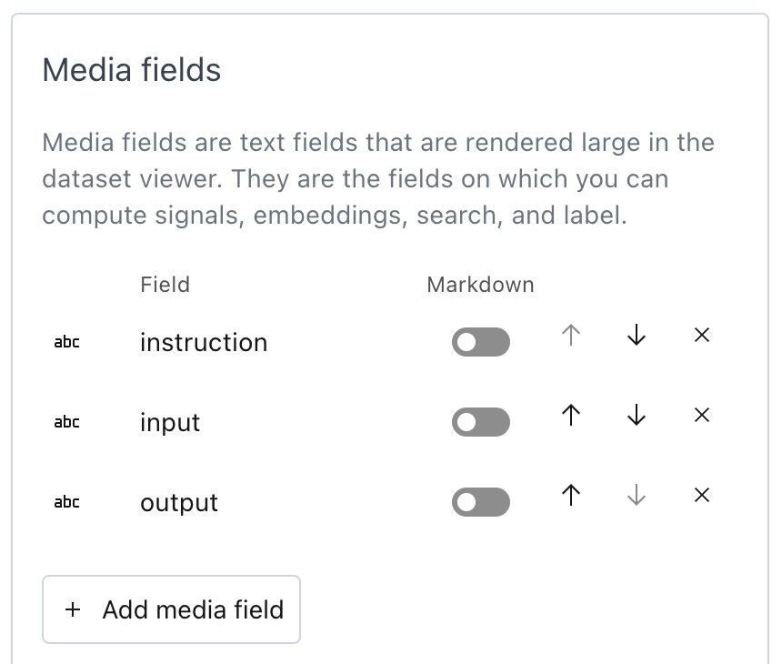
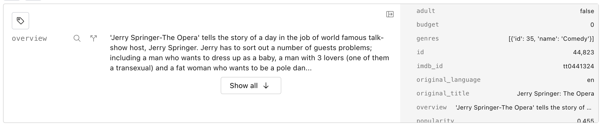
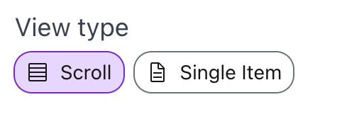
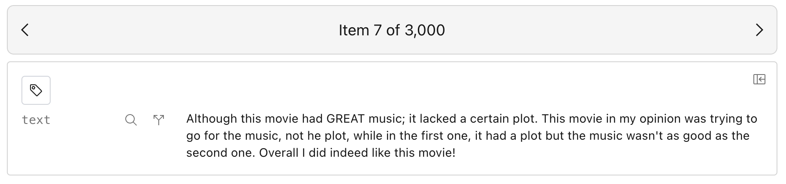
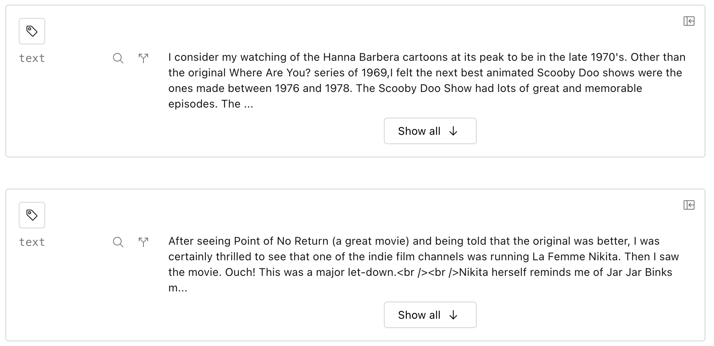

# Configure a dataset

## From the UI

Datasets can be configured during loading, or in the UI by clicking the "Dataset settings" button in
the top right corner.

</img>

### Media fields

You can elevate certain text fields to _media_ fields, which are rendered large in the dataset
viewer. They are the fields on which you can compute signals, embeddings, search, and label. You can
also mark each field as markdown to use the markdown renderer. When ingesting data, Lilac will
automatically elevate the longest string field as a media field.

</img>

The rest of the fields are _metadata_ fields, which are rendered small on the right hand side of the
item.

</img>

### View type

Lilac can show the results in an infinite scroll or a paginated single item view. In the paginated
single item, you can deep-link to individual data points and use the arrow keys to navigate between
items.

</img>

<table>
  <tr>
    <th>Single item</td>
    <th>Infinite scroll</td>
  </tr>
  <tr>
    <td style="vertical-align:top;"></img></td>
    <td></img></td>
  </tr>
</table>

### Preferred embedding

You can choose which embedding to use as the default for the current dataset across all users. This
embedding will be used to perform semantic and concept search.

## From Python

You can provide [`DatasetSettings`](#lilac.DatasetSettings) when you create a new dataset via
[`DatasetConfig`](#lilac.DatasetConfig):

```python
import lilac as ll

# 'text' is our media path
settings = ll.DatasetSettings(
  ui=ll.DatasetUISettings(
    media_paths=[('text',)]),
    view_type='single-item'
  ),
  preferred_embedding='gte-small'
)
config = ll.DatasetConfig(
  namespace='test_namespace',
  name='test_dataset',
  source=ll.JSONSource(),
  settings=settings,
)
dataset = ll.create_dataset(config)
```

or update the settings of an existing dataset at any time:

```python
dataset.update_settings(settings)
```
