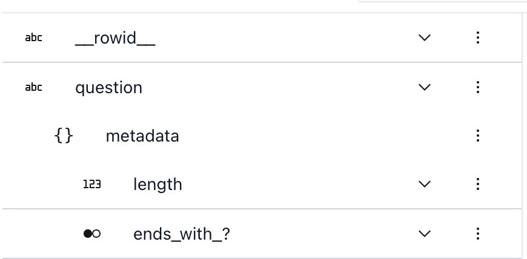

# Edit a dataset

```{note}
This page goes into the technical details of iterating on a dataset in Lilac.
For a real world example, see the blog post on [](../blog/curate-coding-dataset.md).
```

## `Dataset.map`

[`Dataset.map`](#Dataset.map) is the main vehicle for processing data in Lilac. It's similar to
[HuggingFace's Dataset.map()](https://huggingface.co/docs/datasets/process#map) with a few key
differences:

- The output of Lilac's `map` is written to a new column in the _same_ dataset. This enables
  tracking of lineage information for every computed column, while avoiding copying the entire
  dataset.
- If the map fails mid-way (e.g. with an exception, or your computer dies), you can resume
  computation without losing any intermediate results. This is important when the `map` function is
  expensive or slow (e.g. calling GPT to edit data, or calling an expensive embedding model).
- While the computation is running, the Lilac UI will show a progress bar. When it completes, the UI
  will auto-refresh and we can use the new column (see statistics, filter by values, etc).

Let's start with a simple example where we add a `Q: ` prefix to each `question` in the dataset.

```python
import lilac as ll

items = [{'question': 'A'}, {'question': 'B'}, {'question': 'C'}]
dataset = ll.from_dicts('local', 'questions', items)

def add_prefix(item):
  return 'Q: ' + item['question']

dataset.map(add_prefix, output_column='question_prefixed')
dataset.to_pandas()
```

```
  question question_prefixed
0        A              Q: A
1        B              Q: B
2        C              Q: C
```

### `input_path`

If we want to `map` over a single field, we can provide `input_path`. Let's tell Lilac to only read
the `question` field. The map will no longer see the entire row, but just a single value from the
field we care about:

```python
def add_prefix(question):
  return 'Q: ' + question

dataset.map(add_prefix, input_path='question', output_column='question_prefixed2')
dataset.to_pandas()
```

```
  question question_prefixed question_prefixed2
0        A              Q: A               Q: A
1        B              Q: B               Q: B
2        C              Q: C               Q: C
```

`input_path` is very useful for:

- keeping the `map` code reusable, by decoupling the processing logic from the input schema.
- transforming an arbitrarily nested list, because Lilac can handle the nested input for us and
  mimic the same nested structure in the output column.

Let's make a new dataset with a nested list of questions:

```python
items = [
  {'questions': ['A', 'B']},
  {'questions': ['C']},
  {'questions': ['D', 'E']},
]
dataset = ll.from_dicts('local', 'nested_questions', items)
dataset.to_pandas()
```

```
  questions
0    [A, B]
1       [C]
2    [D, E]
```

Let's do the map again, but this time we'll use `input_path=('questions', '*')` to tell Lilac to map
over each individual item in the `questions` list. This is equivalent to mapping over the flattened
list `['A', 'B', 'C', 'D', 'E']`.

```python
def add_prefix(question):
  return 'Q: ' + question

dataset.map(add_prefix, input_path=('questions', '*'), output_column='questions_prefixed')
dataset.to_pandas()
```

```
  questions questions_prefixed
0    [A, B]       [Q: A, Q: B]
1       [C]             [Q: C]
2    [D, E]       [Q: D, Q: E]
```

We can see that the `questions_prefixed` column is a nested list, with the same nestedness as the
`questions` column.

### `output_column`

To test the map function while developing without writing to a new column, we can omit the
`output_column` argument and print the result of `map`:

```python
result = dataset.map(add_prefix, input_path='question')
print(list(result))
> ['Q: B', 'Q: C', 'Q: A']
```

### Structured output

Often our maps will output multiple values for a given item, e.g. when calling GPT to extract
structure from a piece of text. If the output of the `map` function is a `dict`, Lilac will
automatically unpack the `dict` and create nested columns under the `output_column`. This is useful
when we want to output multiple values for a single input item. For example, we can use a `map`
function to compute the length of each question, and whether it ends with a question mark:

```python
items = [
  {'question': 'How are you today?'},
  {'question': 'What kind of food'},
  {'question': 'Are you sure?'},
]
dataset = ll.from_dicts('local', 'questions3', items)

def enrich(question):
  return {'length': len(question), 'ends_with_?': question[-1] == '?'}

dataset.map(enrich, input_path='question', output_column='metadata')
dataset.to_pandas()
```

```
             question  metadata.length  metadata.ends_with_?
0  How are you today?               18                  True
1   What kind of food               17                 False
2       Are you sure?               13                  True
```

If we start the Lilac web server via `ll.start_server()` and open the browser, we can see the new
column statistics in the UI and filter by their values:

<video loop muted autoplay controls src="../_static/dataset/filter_metadata.mp4"></video>

### Parallelism

By default Lilac will run the `map` on a single thread. To speed up computation, we can provide
`execution_type` and `num_jobs`. Executing type can be either `threads` or `processes`. Threads are
better for network bound tasks like making requests to an external server, while processes are
better for CPU bound tasks, like running a local LLM.

The number of jobs defaults to the number of physical cores on the machine. However, if our map
function is making requests to an external server, we can increase the number of jobs to reach the
desired number of requests per second.

```python

def compute(text):
  # make a single request to an external server.

dataset.map(add_prefix, input_path='question', execution_type='threads', num_jobs=10)
```

Assuming a latency of 100ms per request, we can expect to make 10 requests per second with a single
job, and 100 requests per second with 10 jobs.

### Annotations

Often our map will extract relevant information that we want to associate with the input text. For
example, when detecting company names, we want to know the location where each company name was
found. We can do this by using [](#lilac.span) annotation.

```python
import re

items = [
  {'text': 'Company name: Apple Inc.\n Apple Inc is a ...'},
  {'text': 'Google LLC is a ... Company name: Google LLC'},
  {'text': 'There is no company name here'},
]
dataset = ll.from_dicts('local', 'company', items)

def extract_company(text):
  pattern = r'Company name: (.*)?\s'
  matches = re.finditer(pattern, text)
  return [ll.span(m.span(1)[0], m.span(1)[1]) for m in matches]


dataset.map(extract_company, input_path='text', output_column='company')
dataset.to_pandas()
```

Lilac will then highlight the spans in the UI when we filter by the `company` column:

<video loop muted autoplay controls src="../_static/dataset/company_name_span.mp4"></video>

### `nest_under`

By default, Lilac will create a top level column to store the output of `map`. If we want to nest
the output of a map under an existing column, we can use the `nest_under` argument:

```python
items = [
  {'question': 'How are you today?'},
  {'question': 'What kind of food'},
  {'question': 'Are you sure?'},
]
dataset = ll.from_dicts('local', 'questions3', items)

def enrich(question):
  return {'length': len(question), 'ends_with_?': question[-1] == '?'}

dataset.map(enrich, input_path='question', output_column='metadata', nest_under='question')
dataset.to_pandas()
```

```
             question  question.metadata.length  question.metadata.ends_with_?
0  How are you today?                        18                           True
1   What kind of food                        17                          False
2       Are you sure?                        13                           True
```

</img>
