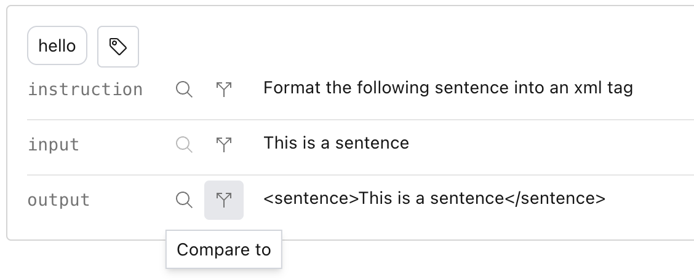
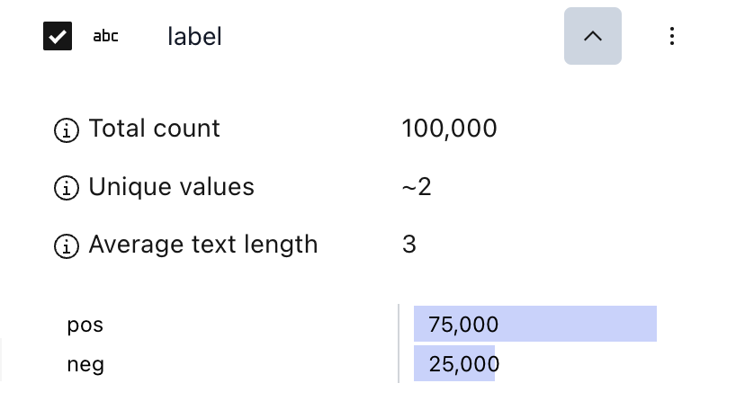
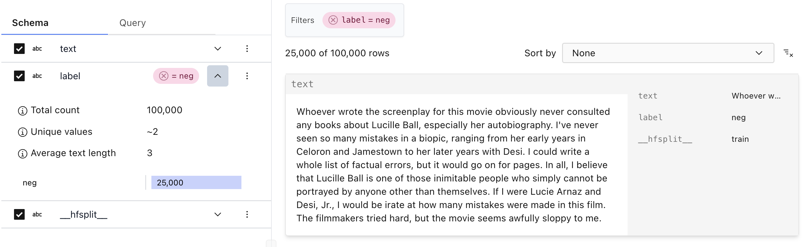
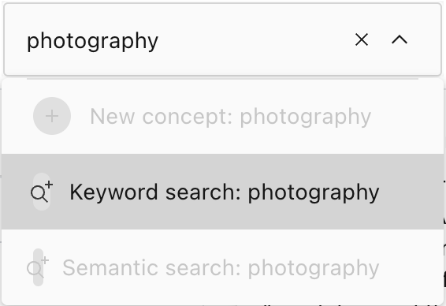
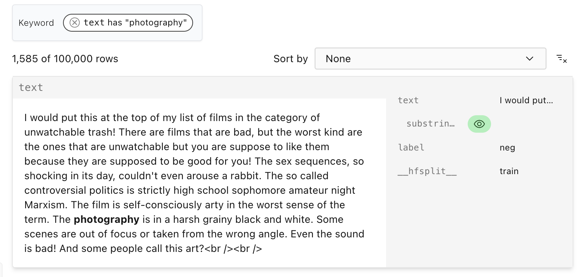
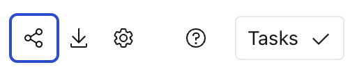

# Explore a dataset (UI)

```{tip}
[Follow along on HuggingFace with the `imdb` dataset](https://lilacai-lilac.hf.space/datasets#lilac/imdb)
```

Exploring a dataset is useful to understand what's inside, or even find glaring dataset bugs.

After loading a dataset you'll be redirected to the dataset viewer. For more on loading datasets,
see [Load a dataset](./dataset_load.md).

</img>

#### Items

The right hand side contains a panel where we can see the examples with their metadata. You can
choose between an infinite scroll or a paginated single item view via the
[view type](./dataset_configure.md#view-type) in the [dataset settings](./dataset_configure.md)
menu.

##### Compare mode

When looking at a single item, you can compare any two fields by clicking on the compare icon:

</img>

</img>

The compare mode is very useful for comparing two versions of the same field, before and after
applying a dataset transformation.

#### Schema

The left hand side contains the schema, which represents the columns.

If we open up the expand icon for the `label`, we'll see a histogram that shows us the distribution
of values for the feature:

</img>

Here we can see that there are 75,000 examples with the label `pos` and 25,000 examples with the
label `neg`.

If we click on one of the bars of the histogram, we'll apply a filter with that label:

</img>

#### Keyword search

Before we do advanced searching, like concept or semantic search, we can immediately use keyword
search by typing a keyword in the search box and choosing "keyword search":

</img>

This will add a search pill to add a filter for the keyword search, with the query bolded in
results. Filters are chained, so if you perform another keyword search it will find examples where
both keywords are present.

</img>

#### Sharing URLs

After clicking around and finding interested findings in datasets, we can share the URL to exactly
the view we are looking at by:

- Copying the URL
- Clicking the Copy URL Icon

</img>

The URL will have a hash-identifier that represents the UI state you are in.
