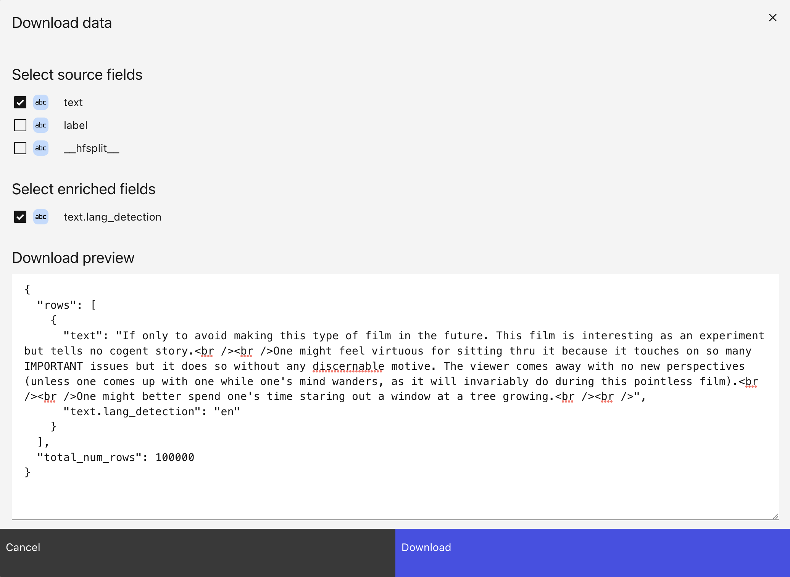

# Export data

```{tip}
[Download enrichments for popular datasets on HuggingFace](https://lilacai-lilac.hf.space/)
```

Once we've computed signals and concepts over a dataset, it can be very useful to download the
results so downstream applications can used the enrichments.

## From the UI

We can download the results by clicking the Download icon in the top-right of the dataset view:

</img>

This will open a modal which lets you choose fields to download, with a preview of the download
results:

</img>

Click "Download" to download the results as a JSON file from the browser.

## From Python

In Python, we can call `select_rows` to download the JSON. Let's download `text` and
`text.language_detection`:

```python
dataset = ll.get_dataset('local', 'imdb')

# Select 'text' and 'text.language_detection'.
# NOTE: you can select lang detection with 'text.lang_detection' or ('text', 'language_detection')
results = dataset.select_rows(['text', ('text', 'lang_detection'), 'text'])

# Print the first result.
# NOTE: `results` is an iterable of dicts (not a list).
print(next(iter(results)))
```

Output:

```
{'text': "If only to avoid making this type of film in the future. This film is interesting as an experiment but tells no cogent story.<br /><br />One might feel virtuous for sitting thru it because it touches on so many IMPORTANT issues but it does so without any discernable motive. The viewer comes away with no new perspectives (unless one comes up with one while one's mind wanders, as it will invariably do during this pointless film).<br /><br />One might better spend one's time staring out a window at a tree growing.<br /><br />", 'text.lang_detection': 'en', 'text_2': "If only to avoid making this type of film in the future. This film is interesting as an experiment but tells no cogent story.<br /><br />One might feel virtuous for sitting thru it because it touches on so many IMPORTANT issues but it does so without any discernable motive. The viewer comes away with no new perspectives (unless one comes up with one while one's mind wanders, as it will invariably do during this pointless film).<br /><br />One might better spend one's time staring out a window at a tree growing.<br /><br />"}
```

If the dataset is too large, you can chunk the results by using `limit` and `offset`. In this
example, the chunk size is 2 for demonstration purposes:

```python
limit = 2
offset = 0
# Get the total number of rows from the dataset.
num_items = dataset.manifest().num_items
while offset < num_items:
  items = dataset.select_rows(['text', ('text', 'lang_detection'), 'text'],
                              limit=limit,
                              offset=offset)
  print(list(items))

  offset += limit
```

Output (each row is a chunk of results):

```
[{'text': 'If the term itself were not geographically and semantically meaningless, one might well refer to "Ned Kelly" as an "Australian Western." For the people Down Under, Ned Kelly was, apparently, a folk hero bandit akin to Robin Hood, Jesse James, Bonnie and Clyde, and Butch Cassidy and the Sundance Kid. The descendant of Irish immigrants, Kelly became a fugitive and an outlaw after he was falsely accused of shooting an Australian law officer, a crime for which his equally innocent mother was put into prison. To get back at the government for this mistreatment, Kelly, his brother Dan, and two other companions, became notorious bank robbers, winning over the hearts of many people in the countryside while striking a blow for justice in a land where Irish immigrants were often treated with disrespect and disdain by those who ran the country.<br /><br />Perhaps because we've encountered this "gentleman bandit" scenario so many times in the past, "Ned Kelly" feels awfully familiar and unoriginal as it pays homage to any number of the genre's stereotypes and clichés on its way to the inevitable showdown. Ned is the typical heart-of-gold lawbreaker who kills only when he is forced to and, even then, only with the deepest regret. He also has the pulse of the common folk, as when, in the middle of a bank robbery, he returns a valuable watch to one of the customers, after one of his gang has so inconsiderately pilfered it. What movie on this particular subject hasn't featured a scene like that? It's acts of selective generosity like this, of course, that earn him the love and respect of all the little people who come to secretly admire anyone who can get away with sticking it to the powers-that-be and the status quo. Geoffrey Rush plays the typical bedeviled law enforcer who feels a personal stake in bringing down this upstart troublemaker who keeps getting away with tweaking the establishment. There's even the inevitable episode in which one of the ladies being held up goes into the next room and has sex with one of the robbers, so turned on is she by the romantic derring-do of the criminal lifestyle. And the film is riddled with one hackneyed scene like this after another.<br /><br />Heath Ledger fails to distinguish himself in the title role, providing little in the way of substance to make his character either interesting or engaging. It doesn't help that he has been forced to provide a droning voice-over narration that underlines the sanctimoniousness and pretentiousness of both the character and the film.<br /><br />"Ned Kelly" might serve a function of sorts as a lesson in Australian history, but as an entertainment, it's just the same old story told with different accents.', 'text.lang_detection': 'en', 'text_2': 'If the term itself were not geographically and semantically meaningless, one might well refer to "Ned Kelly" as an "Australian Western." For the people Down Under, Ned Kelly was, apparently, a folk hero bandit akin to Robin Hood, Jesse James, Bonnie and Clyde, and Butch Cassidy and the Sundance Kid. The descendant of Irish immigrants, Kelly became a fugitive and an outlaw after he was falsely accused of shooting an Australian law officer, a crime for which his equally innocent mother was put into prison. To get back at the government for this mistreatment, Kelly, his brother Dan, and two other companions, became notorious bank robbers, winning over the hearts of many people in the countryside while striking a blow for justice in a land where Irish immigrants were often treated with disrespect and disdain by those who ran the country.<br /><br />Perhaps because we've encountered this "gentleman bandit" scenario so many times in the past, "Ned Kelly" feels awfully familiar and unoriginal as it pays homage to any number of the genre's stereotypes and clichés on its way to the inevitable showdown. Ned is the typical heart-of-gold lawbreaker who kills only when he is forced to and, even then, only with the deepest regret. He also has the pulse of the common folk, as when, in the middle of a bank robbery, he returns a valuable watch to one of the customers, after one of his gang has so inconsiderately pilfered it. What movie on this particular subject hasn't featured a scene like that? It's acts of selective generosity like this, of course, that earn him the love and respect of all the little people who come to secretly admire anyone who can get away with sticking it to the powers-that-be and the status quo. Geoffrey Rush plays the typical bedeviled law enforcer who feels a personal stake in bringing down this upstart troublemaker who keeps getting away with tweaking the establishment. There's even the inevitable episode in which one of the ladies being held up goes into the next room and has sex with one of the robbers, so turned on is she by the romantic derring-do of the criminal lifestyle. And the film is riddled with one hackneyed scene like this after another.<br /><br />Heath Ledger fails to distinguish himself in the title role, providing little in the way of substance to make his character either interesting or engaging. It doesn't help that he has been forced to provide a droning voice-over narration that underlines the sanctimoniousness and pretentiousness of both the character and the film.<br /><br />"Ned Kelly" might serve a function of sorts as a lesson in Australian history, but as an entertainment, it's just the same old story told with different accents.'}, {'text': "This movie never made it to theaters in our area, so when it became available on DVD I was one of the first to rent it. For once, I should listened to the critics and passed on this one.<br /><br />Despite the excellent line up of actors the movie was very disappointing. I can see now why it went straight to video. <br /><br />I had thought that with Bloom, Ledger, and Rush it could have some value. All have done wonderful work in the past. <br /><br />The movie was slow moving and never pulled me in. I failed to develop much empathy for the characters and had to fight the urge to fast-forward just to get to the end. <br /><br />I do not recommend this film even if you are thinking of renting it for only for 'eye candy' purposes. It won't satisfy even that.", 'text.lang_detection': 'en', 'text_2': "This movie never made it to theaters in our area, so when it became available on DVD I was one of the first to rent it. For once, I should listened to the critics and passed on this one.<br /><br />Despite the excellent line up of actors the movie was very disappointing. I can see now why it went straight to video. <br /><br />I had thought that with Bloom, Ledger, and Rush it could have some value. All have done wonderful work in the past. <br /><br />The movie was slow moving and never pulled me in. I failed to develop much empathy for the characters and had to fight the urge to fast-forward just to get to the end. <br /><br />I do not recommend this film even if you are thinking of renting it for only for 'eye candy' purposes. It won't satisfy even that."}]
[{'text': 'I thought this was a very clunky, uninvolving version of a famous Australian story. Heath Ledger and Orlando Bloom were very good in their roles, and gave their characters some personality; but the whole thing felt forced and mechanical.<br /><br />The beginning could have been a lot more involving; perhaps starting with a shootout, and then flashing back for a recap of how they got there or that sort of thing. And I felt like every scene was routinely predictable and signposted, like a very bad tv soap.<br /><br />I was really looking forward to this movie, and hoping for something a lot better. The only thing I can say in its favour is that it beats the Mick Jagger version, but not by much.', 'text.lang_detection': 'en', 'text_2': 'I thought this was a very clunky, uninvolving version of a famous Australian story. Heath Ledger and Orlando Bloom were very good in their roles, and gave their characters some personality; but the whole thing felt forced and mechanical.<br /><br />The beginning could have been a lot more involving; perhaps starting with a shootout, and then flashing back for a recap of how they got there or that sort of thing. And I felt like every scene was routinely predictable and signposted, like a very bad tv soap.<br /><br />I was really looking forward to this movie, and hoping for something a lot better. The only thing I can say in its favour is that it beats the Mick Jagger version, but not by much.'}, {'text': "Ned aKelly is such an important story to Australians but this movie is awful. It's an Australian story yet it seems like it was set in America. Also Ned was an Australian yet he has an Irish accent...it is the worst film I have seen in a long time", 'text.lang_detection': 'en', 'text_2': "Ned aKelly is such an important story to Australians but this movie is awful. It's an Australian story yet it seems like it was set in America. Also Ned was an Australian yet he has an Irish accent...it is the worst film I have seen in a long time"}]
```
