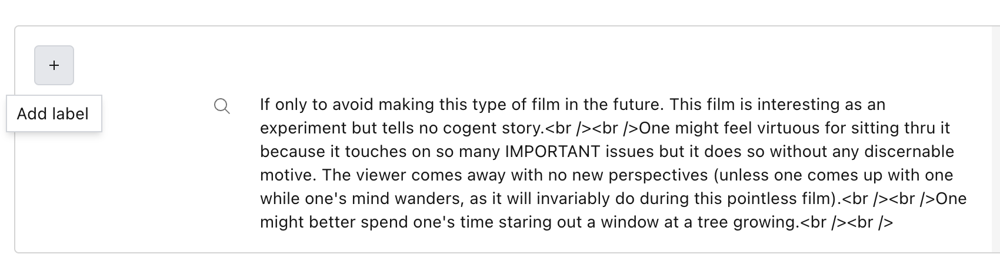
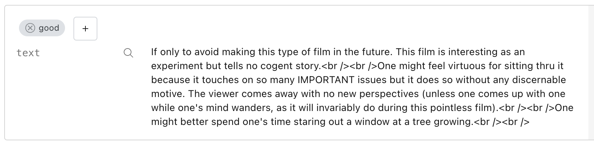
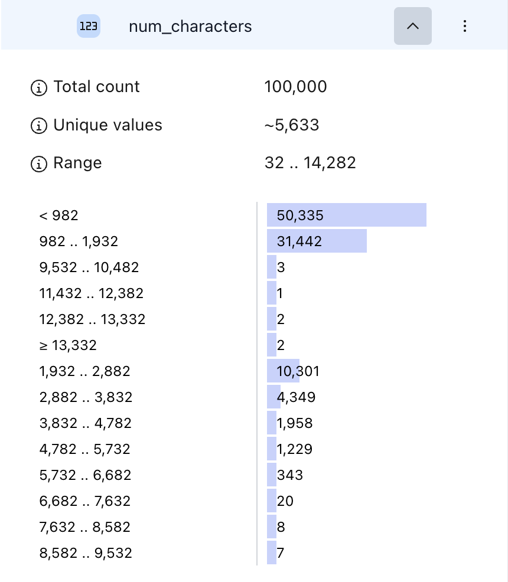
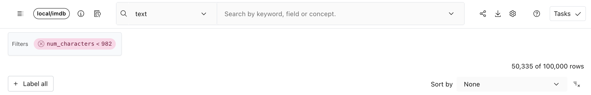
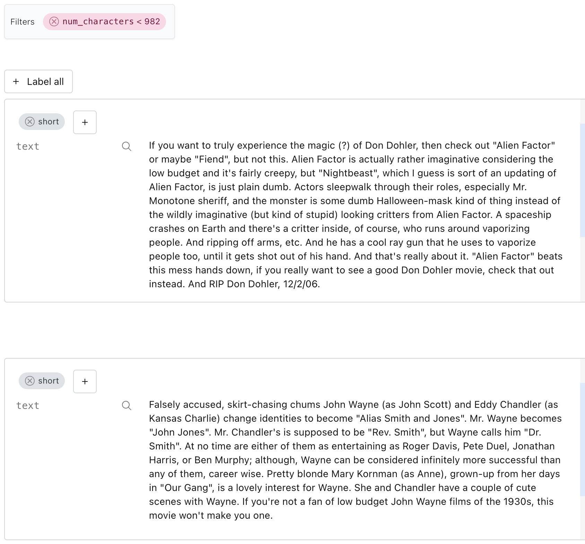
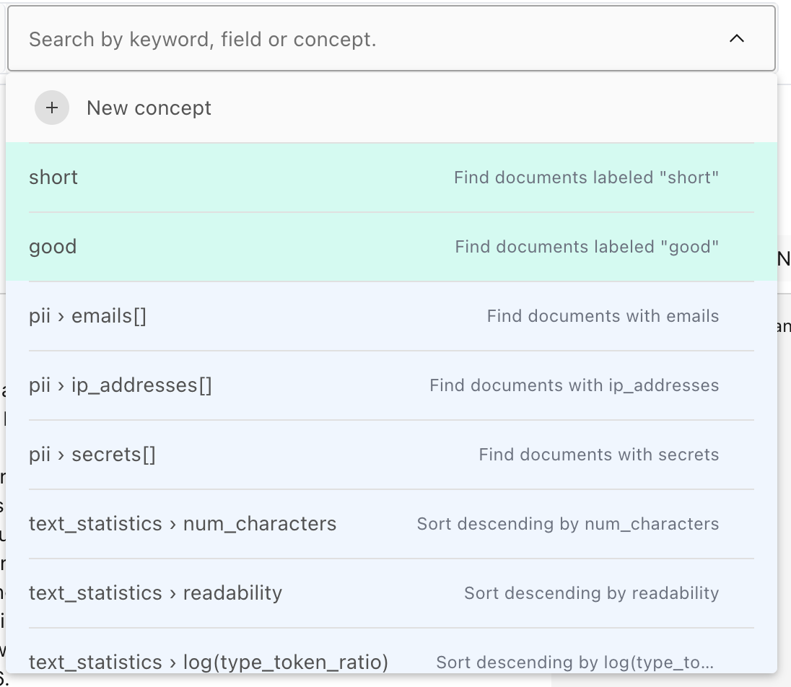
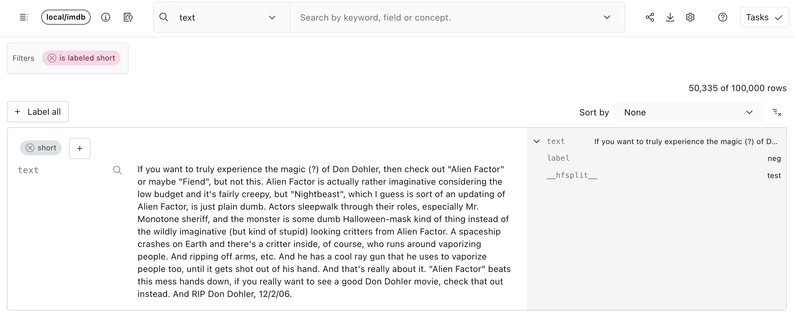
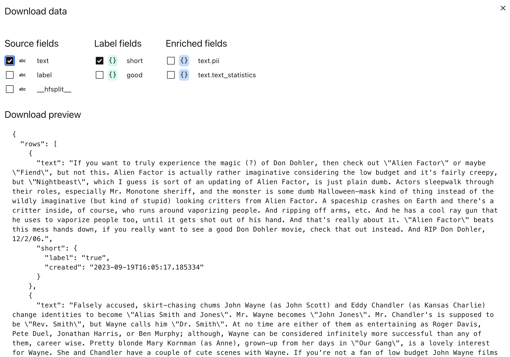

# Labeling a dataset

Lilac allows you to tag individual rows with custom labels that can be later used to prune your
dataset.

## From the UI

### Label individual rows

Once we've loaded a dataset, each row will have a "+" button where you can add labels. Labels are
currently just tags - a row has it, or does not have it.

</img>

This will open up a dialog that lets us create a new tag:

</img>

Once committing the tag, we can see that the row has a new label:

</img>

### Label multiple rows

Labeling individual rows can be time-consuming, so Lilac provides a "Label all" feature, which
allows you label all rows within a given filter.

Let's label rows that have relatively short text. First, open the schema, click on "num_characters"
and click on the first histogram:

</img>

We can see that we're in the cut of the dataset with 50,335 rows, about half of our dataset.

</img>

Now, we can click "Label all", attach a label, and all 50,335 rows will be labeled.

</img>

Once we click the label, the results in view will have that label:

</img>

### Filtering rows with the label

To find all rows with a given label, we can use the search box to filter by the label.

</img>

We can click on the tag pill at any point to apply a filter to show all the labels:

</img>

### Exporting labels

Just like for any other field, we can export labels with the dataset by clicking the "Download" icon
in the top right and checking the label we want.

</img>

## From Python

First, get the IMDB dataset:

```python
import lilac as ll

ll.set_project_dir('~/my_project')

dataset = ll.get_dataset('local', 'imdb')
```

### Labeling individual rows

We can add labels to individual rows from Python by using the [](#Dataset.add_labels) method.

First, let's select the first row and add a label to it. We need to explicitly ask for the `ROWID`
which uniquely identifies a row. We'll use this to label the row.

```python
first_row = list(dataset.select_rows(['*', ll.ROWID], limit=1))

row_id = first_row[0][ll.ROWID]
print(row_id)
```

Output:

```bash
0003076800f1471f8f4c8a1b2deda742
```

Let's add a label `good` to this row.

```python
dataset.add_labels(
  'good',
  row_ids=['0003076800f1471f8f4c8a1b2deda742'])
```

Once we've added the label, we can again query the first row to see the label:

```python
first_row = list(dataset.select_rows(['*', ll.ROWID], limit=1))
print(first_row[0])
```

Output:

```py
{
  '__rowid__': '0003076800f1471f8f4c8a1b2deda742',
  'text': 'If you want to truly experience the magic (?) of Don Dohler, then check out "Alien Factor" or maybe "Fiend"...',
  'label': 'neg',
  '__hfsplit__': 'test',
  'good': {
    'label': 'true',
    'created': datetime.datetime(2023, 9, 20, 10, 16, 15, 545277)
  }
}
```

Notice the new field `good` which has the label value `true`. It also comes with a datetime that it
was created.

### Labeling a selection of rows

Labeling individual rows can be cumbersome in Python, so Lilac provides a way to label multiple rows
at the same time through a query selection.

There are two additional arguments to [](#Dataset.add_labels) which mirror the two arguments in
[](#Dataset.select_rows). See [Querying a Dataset](./dataset_query.md) for more details.

- `searches`: A list of searches to apply before adding labels.
- `filters`: A list of filters to apply before adding labels.

We can use these to apply the label to all results that match the searches and filters.

Let's add a `short` label to all results that are less than 1,000 characters by using the enriched
`text_statistics.num_characters` field.

```
dataset.add_labels(
  'short',
  filters=[
    (('text', 'text_statistics', 'num_characters'), 'less', 1000)
  ]
)
```

### Exporting data

Now that we've added labels to individual rows, we can download the dataset by excluding or
including some of the labels. See [Labels section in Export data](./dataset_export.md#labels) for
more info.

### Querying the labels

You can also query the labels directly from Python, just like any other field.

For the example of `short` above, we'll have a new path added: `('short', 'label')` which has a
`string` dtype.

We can now select all the rows with this label:

```python
short_rows = list(
  dataset.select_rows(
    ['*', 'short'],
    filters=[
      (('short', 'label'), 'exists')
    ]
  )
)

# Print the first row.
print(short_rows[0])
```

Output:

```py
{
  '__rowid__': '0003076800f1471f8f4c8a1b2deda742',
  'text': 'If you want to truly experience the magic (?) of Don Dohler, then check out Alien Factor or maybe Fiend...',
  'label': 'neg',
  '__hfsplit__': 'test',
  'good': {
    'label': 'true',
    'created': datetime.datetime(2023, 9, 20, 10, 16, 15, 545277)
  }
}
```

For more details on querying, see [Querying a Dataset](./dataset_query.md).
