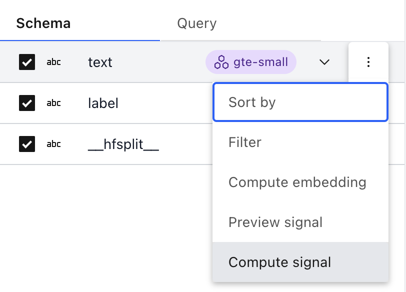
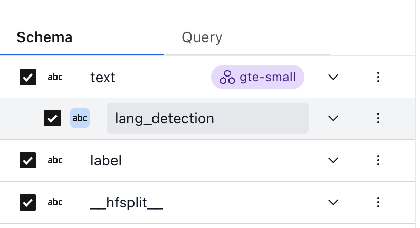
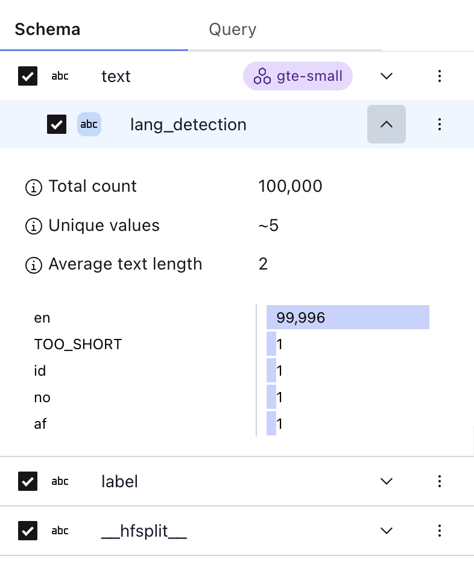

# Apply a signal to a dataset

```{tip}
[Explore enriched datasets in Lilac on HuggingFace](https://lilacai-lilac.hf.space/)
```

[Signals](../signals/signals.md) can be applied to an entire dataset to add metadata to each row of
the dataset. The results of signal computations are saved on disk and can be downloaded as JSON so
they can be used in downstream applications.

## From the UI

Signals can be computed over a field by clicking the overflow menu next to a field, in the left-hand
side Schema panel, and then clicking "Compute Signal":

</img>

This will open a modal which lets you choose a signal, and parameters to the signal:

</img>

Click "Compute" to compute the signal over the field. This will add a task in the top-right corner
of the dataset view.

When the signal is complete, a new column will be added to the Schema underneath the source field.
Signal fields have a blue background:

</img>

These now act as any other field, and we can see the stats:

</img>

## From Python

Signals can be computed from Python:

```python
import lilac as ll

dataset = ll.get_dataset('local', 'imdb')
dataset.compute_signal(ll.LangDetectionSignal(), 'text')

# Print the resulting manifest, with the new field added.
print(dataset.manifest())
```

Output:

```
Computing lang_detection on local/imdb:('text',): 100%|██████████| 100000/100000 [05:38<00:00, 295.27it/s]
Computing signal "lang_detection" on local/imdb:('text',) took 338.808s.
Wrote signal output to ./data/datasets/local/imdb/text/lang_detection
namespace='local' dataset_name='imdb' data_schema={
  "fields": {
    "text": {
      "fields": {
        "lang_detection": {
          "dtype": "string",
          "signal": {
            "split_by_paragraph": false,
            "signal_name": "lang_detection"
          }
        },
        "gte-small": {
          "repeated_field": {
            "fields": {
              "embedding": {
                "dtype": "embedding"
              }
            },
            "dtype": "string_span"
          },
          "signal": {
            "signal_name": "gte-small"
          }
        }
      },
      "dtype": "string"
    },
    "label": {
      "dtype": "string"
    },
    "__hfsplit__": {
      "dtype": "string"
    }
  }
} num_items=100000
```

Once the signal is computed, it acts as any other field. See [Explore a dataset](dataset_explore.md)
for more details on how to query datasets.

You'll notice that the manifest contains a new field "lang_detection" under text fields.

Let's select the first row with the text, and the results of `lang_detection`:

```python
results = dataset.select_rows([('text', 'lang_detection'), 'text'], limit=1)
print(list(results))
```

Output:

```
[{'text.lang_detection': 'en', 'text': "If only to avoid making this type of film in the future. This film is interesting as an experiment but tells no cogent story.<br /><br />One might feel virtuous for sitting thru it because it touches on so many IMPORTANT issues but it does so without any discernable motive. The viewer comes away with no new perspectives (unless one comes up with one while one's mind wanders, as it will invariably do during this pointless film).<br /><br />One might better spend one's time staring out a window at a tree growing.<br /><br />"}]
```

To see a full list of signals, see [](#lilac.signals).
