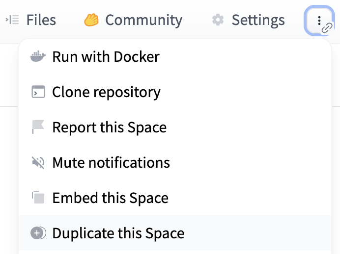
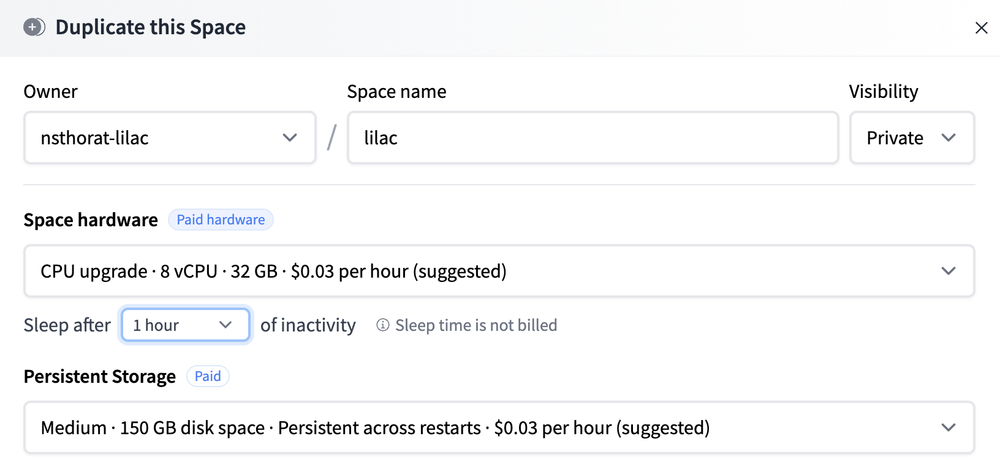
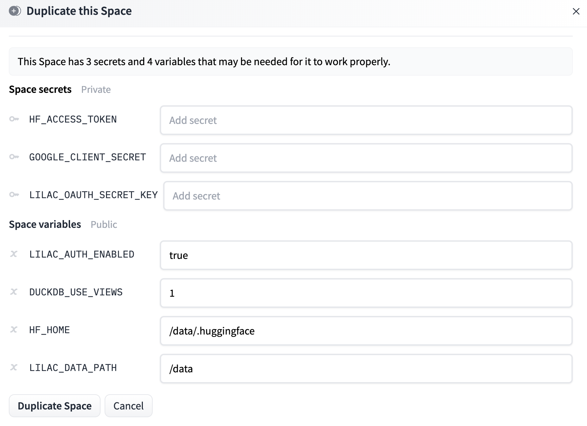
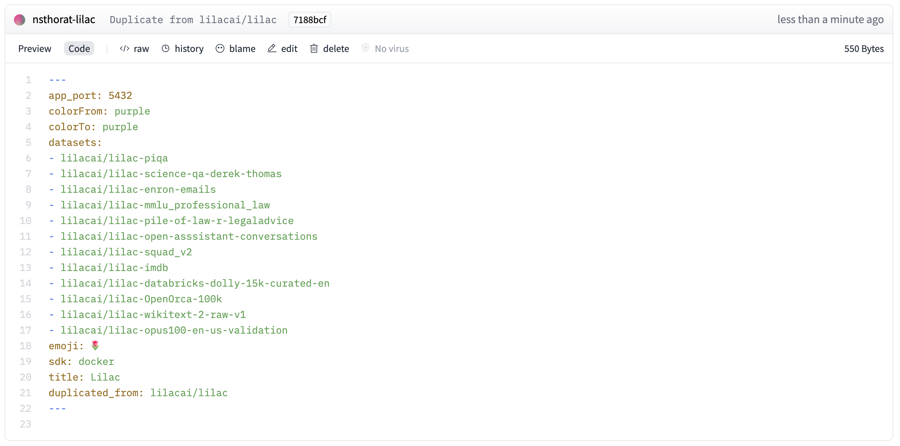

# Deploying on HuggingFace spaces

Lilac projects can be deployed to HuggingFace spaces out of the box.

You can either use our Python API / CLI, or Duplicate our public space.

The accompanying IPython notebook can be found
[here](https://github.com/lilacai/lilac/blob/main/notebooks/MigrateEmbedding.ipynb).

## Option 1: Deploy from Python / CLI

This requires:

- You to be logged in with HuggingFace with `huggingface-cli login`.
- Have the `huggingface_hub` pip package installed.

### Python

#### Deploy a project

To deploy a project directory that you've loaded locally, you can use the [](#ll.deploy_project)
method. For more information on Lilac projects, see [Lilac Projects](../projects/projects.md).

```python
ll.deploy_project(
  hf_space='my_hf_org/my_hf_space',
  project_dir='~/my_project',
  create_space=True  # Create the HuggingFace space if it doesn't exist.
)
```

This will upload all datasets, concepts, model caches. Locally run datasets will be uploaded to
HuggingFace datasets with signals, concepts, embeddings uploaded. These will be downloaded when the
space boots up.

See the Reference for more options for [](#deploy_project).

#### Deploy a `Config`

If you just want to deploy a config, and not run anything locally, you can use [](#deploy_config).
This will push the config to HuggingFace spaces and will load all the data when the server boots up
on HuggingFace.

NOTE: Embeddings, signals, concepts will be computed on HuggingFace, which could be expensive.

Deploy the [glue](https://huggingface.co/datasets/glue) HuggingFace dataset with `config=ax` to
HuggingFace, and load the dataset in the space.

```python
ll.deploy_config(
  hf_space='my_hf_org/my_hf_space',
  create_space=True,
  config=ll.Config(datasets=[
    ll.DatasetConfig(
      namespace='local',
      name='glue_ax',
      source=ll.HuggingFaceSource(dataset_name='glue', config_name='ax'))
  ]))
```

### CLI

You can also deploy a project directly from the CLI:

```sh
lilac deploy-project \
  --hf_space=my_hf_org/my_hf_space \
  --create_space
  --project_dir=~/my_project
```

This will deploy all datasets, concepts, and caches from your project to the HuggingFace space.

If you only want to deploy a subset of datasets, you can pass:
`--dataset local/dataset1 --dataset local/dataset2`

If you only want to deploy a subset of concepts, you can pass:
`--concept local/concept1 --concept local/concept1`

## Option 2: Duplicate the HuggingFace demo

Lilac hosts a [HuggingFace spaces demo](https://lilacai-lilac.hf.space/) so you can try Lilac before
installing it.

Thanks to HuggingFace, this space can be duplicated and customized with your own data. You can
decide to make your duplicated private for use with private or sensitive data.

To duplicate the space, click the hamburger menu in the top-right of the space and click **Duplicate
this Space**:

</img>

This will open a modal which allows to to determine the machine. We recommend using persistent
storage as it will allow you to save results of computations permanently (loading datasets, making
concepts, computing signals and concepts). However, if you decide not to pay for persistent storage,
you can still use Lilac, but results of computations will lost when the image reboots.

</img>

The modal also contains options for environment variables.

</img>

**Secrets**:

- `HF_ACCESS_TOKEN`: If your space is private or reads from private data hosted on HuggingFace, set
  this to a HuggingFace access token with read permissions, allowing the space to download the
  datasets upon boot. See
  [HuggingFace User access tokens](https://huggingface.co/docs/hub/security-tokens) for more
  details.
- `GOOGLE_CLIENT_SECRET`: If you wish to enable authentication on your server, define this variable
  to be the client secret of a Google Application you create. You should also define
  `GOOGLE_CLIENT_ID`. Details can be found at
  [Using Oauth 2.0 to Access Google APIs](https://developers.google.com/identity/protocols/oauth2).
- `LILAC_OAUTH_SECRET_KEY`: If you wish to enable authentication on your server, this should be
  defined as a random string. Details in the Oauth link above.

**Space variables**:

- `LILAC_AUTH_ENABLED`: Whether to enable Google authentication on your duplicated server. Set this
  to `false`, or delete it, to disable Google authentication. If your HuggingFace space is private,
  you can set this to `false` and rely on HuggingFace space authentication.
- `DUCKDB_USE_VIEWS`: Whether DuckDB uses views (1), or DuckDB tables (0). Views allow for much less
  RAM consumption, with a runtime query penalty. When using DuckDB tables (0), demos will take more
  RAM but be much faster.
- `HF_HOME`: This should be kept `/data/.huggingface` if you plan on using Persistent Storage. This
  allows the HuggingFace cache to be persistent. If you are not, you should remove this variable
  entirely.
- `LILAC_PROJECT_DIR`: The path where data for datasets, concept models and Lilac caches are stored.
  This should be kept `/data` if you plan on using Persistent Storage. If you are not, this should
  be set to the relative path `./data` which lives ephemerally in the docker image. It is important
  to use `./data` because it has been given writen permissions by the docker image. See
  [HuggingFace Disk usage on Spaces](https://huggingface.co/docs/hub/spaces-storage) for
  documentation on Persistent Storage.
- `LILAC_DATA_PATH`: Deprecated in favor of `LILAC_PROJECT_DIR`.
- `GOOGLE_ANALYTICS_ENABLED`: Set this to "false" to disable our Google Analytics tracking on the
  HuggingFace demo. We use this just to track basic session information on the public demo.

After you click the duplicate space button, the space will be duplicated and start building the
docker image in your own space.

Once the image is built, your space is now running a personalized Lilac instance!

For more details on environment variables, see [Environment Variables](../environment/variables.md).

### Removing datasets

You'll notice that the demo will try to load the same datasets from the lilacai/lilac space. This
may lead to an out of memory error when cloning locally.

To remove these, edit the `README.md` on the space and delete the datasets under the linked
`datasets` field for the HuggingFace space configuration. The space will restart.

If these datasets were synced in the process, you can delete them from the UI.

</img>
