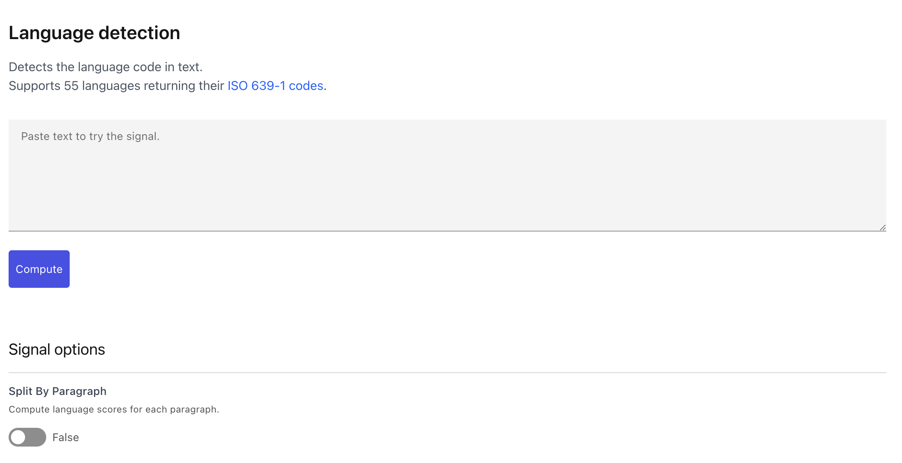
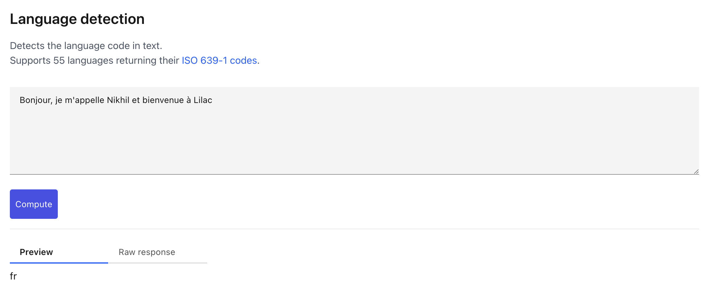

# Signals

```{tip}
[Try Lilac signals on HuggingFace](https://lilacai-lilac.hf.space/)
```

There are two types of [](#Signal) base classes based on the input:

- [](#TextSignal): Takes text and returns metadata.
- [](#TextEmbeddingSignal): Takes embeddings and returns metadata. [](#ConceptSignal)s are an
  implementation of this class.

Signals can be simple python functions, complicated machine learning models, or functions that make
requests to external services.

Lilac also allows you to register your own Python function to be used as a Signal in the UI or from
Python. See [Create a signal](signals_create.md) for details.

## From the UI

If we open a signal preview page from the "Signals" panel in the left-hand side navigation, we will
open the preview page for a signal, in this case language detection:

</img>

We can try the signal out by entering text, and pressing "Compute":

</img>

We can see that the detected language is "french".

To apply a signal to an entire dataset, see
[Apply a signal to a dataset](../datasets/dataset_signals.md).

## From Python

We can compute a signal over text from Python as well:

```python
import lilac as ll

lang_detection = ll.LangDetectionSignal()

# Signals take an iterable of input, and return an iterable of outputs. This is very useful for performance as many signals will perform batch computation.
signal_output = lang_detection.compute(
  ["Bonjour, je m'appelle Nikhil et bienvenue à Lilac"])

print(list(signal_output))
```

Output:

```
['fr']
```
