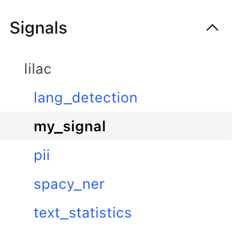
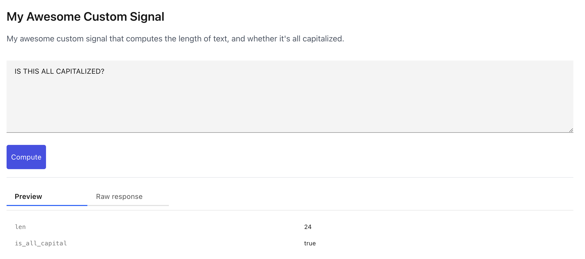

# Create a signal

Signals can be created and registered with Lilac, then used from the UI or from Python.

Signals can only be created in Python. See [Signals](signals.md) for details on signals.

There are two types of [](#Signal) base classes based on the input:

- [](#TextSignal): Takes text and returns metadata.
- [](#TextEmbeddingSignal): Takes embeddings and returns metadata. [](#ConceptSignal)s are an
  implementation of this class.

## Define the signal

Let's create a signal that emits:

- `len`: The length of the text, in number of characters.
- `is_all_capital`: A boolean that determines whether all of the letters are capitalized.

To create a signal, we extend from one of these two classes:

```python
import lilac as ll

class MySignal(ll.TextSignal):
  """My awesome custom signal that computes the length of text, and whether it's all capitalized."""

  # The unique identifier for the signal. This must be globally unique.
  name = 'my_signal'
  # The display name will show up in the UI.
  display_name = 'My Awesome Custom Signal'

  # Set the input type of the signal to text.
  input_type = ll.SignalInputType.TEXT

  def fields(self):
    return ll.field(fields={
      'len': 'int32',
      # See lilac.DataType for details on datatypes.
      'is_all_capital': 'boolean'
    })

  def setup(self):
    # Do any one-time setup work.
    pass

  def compute(self, data):
    for text in data:
      yield {
        'len': len(text),
        # Determine whether all the letters are capitalized.
        'is_all_capital': text.upper() == text
      }

my_signal = MySignal()
results = my_signal.compute(['hi', 'WORLD'])

print(list(results))
```

Output:

```
[{'len': 2, 'is_all_capital': False}, {'len': 5, 'is_all_capital': True}]
```

The signal can also be used to compute over an entire dataset, see
[Apply a signal to a dataset](../datasets/dataset_signals.md) for more details:

```python
dataset = ll.get_dataset('local', 'imdb')
dataset.compute_signal(MySignal(), 'text')

results = dataset.select_rows([('text', 'my_signal'), 'text'], limit=1)
print(list(results))
```

Output:

```
[{'text.my_signal': {'len': 528, 'is_all_capital': False}, 'text': "If only to avoid making this type of film in the future. This film is interesting as an experiment but tells no cogent story.<br /><br />One might feel virtuous for sitting thru it because it touches on so many IMPORTANT issues but it does so without any discernable motive. The viewer comes away with no new perspectives (unless one comes up with one while one's mind wanders, as it will invariably do during this pointless film).<br /><br />One might better spend one's time staring out a window at a tree growing.<br /><br />"}]
```

See [Exploring a dataset](../datasets/dataset_explore.md) for more options for querying results.

## Register the signal

Let's register the signal with Lilac so that we can use it from the UI.

```python
ll.register_signal(MySignal)
```

Start a Lilac webserver with:

```python
ll.start_server(project_path='~/my_project')
```

Output:

```python
INFO:     Started server process [51748]
INFO:     Waiting for application startup.
INFO:     Application startup complete.
INFO:     Uvicorn running on http://127.0.0.1:5432 (Press CTRL+C to quit)
```

Let's open the webserver in our web browser. You'll notice the signal is now in the list of signals
in the left:

</img>

When we open that, we'll see the signal available to preview, like any other signal:

</img>

See [Signals](signals.md) for more details on using signals.
